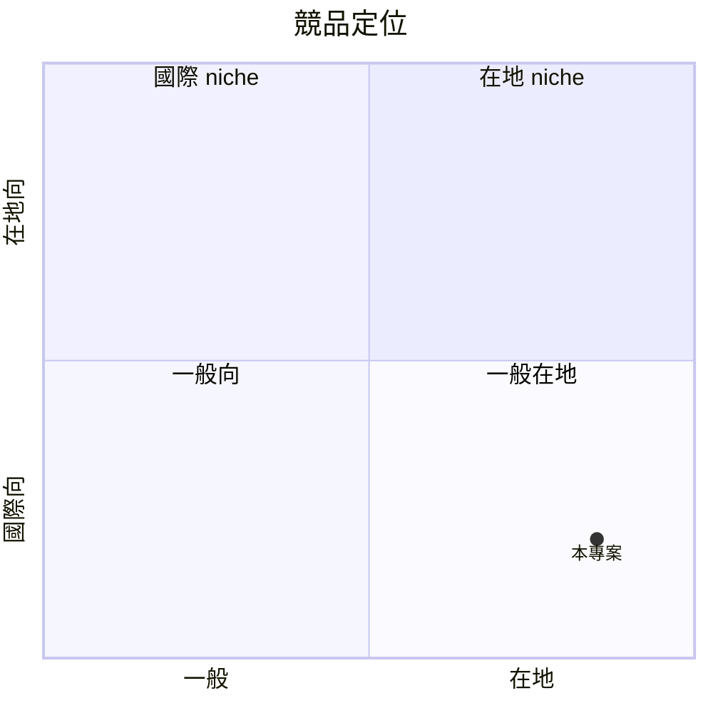

# Ebook to Audiobook — 規格書 v3.0

> **專案**：Ebook to Audiobook（EPUB/PDF → 多角色 TTS audiobook + Podcast RSS）
> **PRD 版本**：v3.0（forced upgrade；Sweet Spot 5 問重評）
> **撰寫日期**：2026-07-19
> **Git branch**：`master`
> **作者**：Sean（PRD specialist 批次 B 重寫）
> **SSOT 位置**：`/home/sean/Program/ebook-to-audiobook/PRD/SPEC.md`
> **本地路徑**：`/home/sean/Program/ebook-to-audiobook`

---

## 0. v3.0 改版摘要 (What's new)

本版依「電子書轉有聲書（EPUB/PDF → 多角色 TTS audiobook）」重新做 Sweet Spot 5 問，不把全球 TTS 紅海的規模敘事當成市場驗證。產品的 beachhead 仍是繁體中文個人電子書，但輸入由 EPUB 擴至可抽取文字的 PDF，並把「多角色」從未明確的聲音選擇升級為可驗收的角色／聲音 mapping。

| v2.2.2 → v3.0 差異 | 為何改 | 對誰重要 |
|---|---|---|
| 版本與決策日期強制升級為 **v3.0 / 2026-07-19**，branch 固定 `master` | 讓規格、驗證、提交與遠端狀態可追溯 | 維護者與實作者 |
| 入口由「EPUB only」改為 **EPUB/PDF → audiobook** | 視障使用者與自作者常持有 PDF；但 PDF 先限文字型，掃描檔需 OCR | 自作者、有聲書創作者、視障 |
| 核心 wedge 由單一聲音擴為 **多角色 TTS** | 小說對話需要角色一致性；MVP 先做角色表、聲音 mapping、章節內一致 | 有聲書創作者與重度讀者 |
| Sweet Spot 改採 1–10 量表逐題評分；本版 sweet = **7.8/10** | 把「已知證據」與「待驗證假設」分開，不再使用混合公式 | 決策者 |
| 商業化採指定公式 **30 + sweet×7 = 84.6/100** | 依任務要求如實計算，不取保守、不把它誤寫成實收營收 | 商業化與 pilot 決策 |
| 新增 §15.11 v3.0 量表、§15.12 五項 ADR、§15.13 五項市場驗證 | 讓分數能被重算、架構能被追責、兩週內能產生反駁證據 | 一人公司執行 |

### v3.0 行動建議（先驗證，再擴功能）

1. **48 小時內**：用 3 份自有／獲授權的 EPUB 與 2 份文字型 PDF 做解析 spike；確認章節、對話、頁首頁尾、表格與 Unicode 繁中不會被破壞。掃描 PDF 明確標記 OCR 為 P1，不在 MVP 假裝已解決。
2. **第 1 週**：做「角色表 → 聲音 mapping → 章節試聽」vertical slice；至少支援旁白 + 3 個角色、每角色固定聲音、可手動覆寫誤判。
3. **第 1–2 週**：完成 5 組訪談（自作者／有聲書創作者／視障各至少 1 組），用 §15.13 的可計算門檻記錄真實行為：是否帶來檔案、是否試聽、是否留下 email、是否付費或預購。
4. **第 2 週**：以 10 份獲授權樣本跑成本、延遲、可理解度與可存取性測試；再決定 Google/Azure/其他 provider，不以「品質佳」的未量測描述直接定案。
5. **Go / no-go**：兩週達到 §15.13 的反駁門檻才進入 Stripe、RSS hosting 與 voice clone；未達門檻就 freeze 非核心功能，依數據縮窄 persona 或改定價。

---

## 1. 產品概述 (Product Overview)

### 1.1 問題陳述 (Problem Statement)

**核心問題**：自作者、有聲書創作者與視障／低視力使用者，手上有 EPUB 或文字型 PDF，想在通勤、校對、家事或閱讀輔助情境聽完自己的內容；但現有工具多半只解決「朗讀」或單一聲音，沒有「上傳自己的檔案 → 偵測旁白／角色 → 固定多角色聲音 → 可訂閱 audiobook」的完整流程。現有 workaround（閱讀器 TTS、通用 TTS、Calibre 加人工剪輯）仍有繁中品質、角色一致性、PDF 排版噪音、設定門檻與無障礙操作問題。v3.0 先支援可抽取文字的 PDF；掃描 PDF 的 OCR 明確列為 P1，不把未驗證能力寫成已完成。

**市場證據（待 §15.13 驗證，不當作已實收）**：
- 台灣 EPUB 讀者約 80-120 萬（博客來 + Readmoo + Kobo 2024 活躍用戶估算）
- 香港繁中讀者約 60-100 萬
- 「Podcast 訂閱」「有聲書 Podcast」關鍵字 Apple Podcasts 台灣榜 2024-2026 持續成長
- 痛點強度：7/10（通勤族、運動族、家事族每月 5-15 次需求）

### 1.2 目標使用者 (User Personas)

**Primary persona — 小瑜（32 歲台北行銷主管）**：
- 背景：通勤 1.5 小時/天，喜歡讀書但沒時間看，書庫有 80 本 EPUB（博客來 + Kobo）
- 痛點：想聽自己的書，但 Apple Books 中文有聲書只買得到暢銷書，她的書都沒有
- 現有 workaround：用 Readmoo App TTS（品質差，沒有 podcast 訂閱）
- 付費意願：願意付 NT$149-NT$399/月（粗估）
- AARRR：找得到 → 用得上 → 願意付 → 留下來

**Secondary persona — 阿志（38 歲香港工程師，業餘作家）**：
- 背景：自己寫了 3 本繁中 EPUB（小說），想聽自己的書順便推廣
- 痛點：想生成「作者本人聲音 podcast」（可用 ElevenLabs voice clone），但 ElevenLabs 沒有繁中 podcast RSS 整合
- 付費意願：願意付 NT$399/月 + NT$4,000 終身 voice clone setup

**Tertiary persona — Mandy（45 歲台中家庭主婦）**：
- 背景：喜歡讀小說但視力退化，需要有聲版
- 痛點：買不到中文有聲版，自己轉 TTS 又難用
- 付費意願：願意付 NT$199 終身（單次買斷）

**v3.0 目標受眾邊界**：
- **自作者**：需要在出版前聽稿、校對發音，或把自有作品交付成可下載 audiobook。
- **有聲書創作者**：需要旁白／角色聲音 mapping、可重跑的章節批次與一致的角色音色，降低試聽與後製成本。
- **視障／低視力使用者**：需要鍵盤、螢幕閱讀器友善的上傳、角色設定、播放與進度流程；只處理使用者擁有或獲授權的內容。

### 1.3 核心價值主張 (Value Proposition)

> **「把自己的 EPUB／PDF 變成多角色繁中 audiobook，角色聲音一致，並以 podcast RSS 或下載檔帶走。」**

- **For** 自作者、有聲書創作者、視障／低視力使用者（先以繁中內容為 beachhead）
- **Who** 需要把自有 EPUB／PDF 轉成可聽、可校對、可訂閱的 audiobook
- **Our product is** 一個 EPUB／文字型 PDF → 多角色 TTS audiobook 工具
- **That** 先解析角色與章節，再在可接受延遲內產生角色一致的多章節音檔與 podcast feed
- **Unlike** Speechify（60M users 但無繁中 TTS 品質）、念華書（訂閱制但無個人書庫）、Readmoo App TTS（品質差無 podcast RSS）、Calibre 手動（複雜）
- **Our product** 用「繁中 TTS + 多章節切分 + podcast RSS feed + 個人書房 + 作者聲音 clone」一站式

### 1.4 商業目標 (KPIs / OKRs)

| 時間 | 指標 | 目標 |
|---|---|---|
| 30 天 pilot | 付費用戶 | ≥ 5 |
| 30 天 pilot | 訂閱 podcast RSS | ≥ 8 個成長（追蹤數 + 收藏） |
| 60 天 | 留存 D30 | ≥ 30% |
| 90 天 | MRR | NT$ 15,000（≈ 50 訂閱 NT$149 + 15 訂閱 NT$399） |
| 180 天 | 平台支援 | 繁中 + 簡中 + 英（試水溫） |

### 1.5 ⭐ Non-Goals (明確不做)

**Sweet spot 提醒**：全球 TTS audiobook 紅海不是本產品的評分基準；v3.0 的 sweet 依 §15.11 五題量表計算。
- ❌ **不做英文/西/法主流 TTS**（與 Speechify/ElevenLabs/Apple Books 紅海對打必死）
- ❌ **不做 Spotify/Netflix 級 podcast hosting**（超 scope、需 podcast hosting 牌照）
- ❌ **不做 AI 自動寫有聲書摘要**（成本超支、無法驗證）
- ❌ **不做 iOS/Android app v1**（個人 podcast 用戶桌機/筆電處理 EPUB）
- ❌ **不做 DRM 解除 / 破解付費 EPUB**（違法）
- ❌ **MVP 不做掃描 PDF OCR**（先支援可抽取文字的 PDF；OCR 需另行驗證成本、版權與準確率）
- ❌ **不做 podcast 平台分潤 / 廣告**（與 Apple Podcasts/Spotify 商業模式衝突）

---

## 2. 使用者場景與流程

### 2.1 使用者流程圖

```
[使用者上傳 EPUB／文字型 PDF] → [系統解析章節 + 文字抽取]
        ↓
[選擇 TTS 引擎（內建繁中 NTTS / ElevenLabs 訂閱）]
        ↓
[選擇聲音（內建 5 種繁中 / 自訂 voice clone）]
        ↓
[生成多章節 MP3（背景任務）]
        ↓
[完成 → 產生 podcast RSS feed URL]
        ↓
[使用者複製 RSS URL 到 Spotify/Apple Podcasts 訂閱]
        ↓
[個人書房追蹤進度 + 章節書籤]
```

### 2.2 關鍵用戶故事 (User Stories)

#### US-001：EPUB 一鍵轉 podcast
> As 自作者／視障使用者
> I want 上傳 1 本 EPUB 或文字型 PDF + 設定旁白與角色聲音 → 取得 audiobook 與 podcast RSS URL
> So that 通勤時可以訂閱聽

**Acceptance**：
- 上傳 EPUB 或文字型 PDF（最大 50MB）
- 自動解析章節（顯示章節列表）
- 建立角色表（旁白 + 至少 3 個角色）並為每個角色選聲音
- 同一角色在各章維持相同 voice mapping；可手動修正
- 背景生成 MP3
- 10 分鐘內完成（10 章以內、文字型 PDF／EPUB 的 pilot 基準）
- 產生 RSS URL（私人 feed，含 token）

#### US-002：Spotify/Apple Podcasts 訂閱
> As 小瑜
> I want 複製 RSS URL → 貼到 Spotify/Apple Podcasts → 自動同步新章節
> So that 像訂閱 podcast 一樣簡單

**Acceptance**：
- 顯示 RSS URL + QR code
- 提供「複製 URL」按鈕
- 提供「如何在 Spotify 訂閱」教學連結

#### US-003：作者 voice clone（進階）
> As 阿志（業餘作家）
> I want 上傳 30 分鐘錄音 → 生成自己聲音 TTS
> So that 聽眾聽的是「作者親聲」

**Acceptance**：
- 上傳 30 分鐘以上錄音（wav/mp3）
- 系統呼叫 ElevenLabs voice clone API
- 24 小時內生成完畢
- 可用於所有 EPUB 轉檔

#### US-004：個人書房 + 進度追蹤
> As Mandy（家庭主婦）
> I want 在個人書房看到所有轉過的書 + 聽的進度
> So that 可以接續聽

**Acceptance**：
- 書房顯示書名/封面/章節進度
- 標記上次聽到的章節
- 支援書籤（特定段落）

### 2.3 邊界場景 (Edge Cases)

| 場景 | 處理 |
|---|---|
| EPUB 加密 / DRM | 拒絕 + 提示購買正版 |
| 章節解析失敗 | 自動 fallback 全書單章 |
| TTS 引擎失敗（API 額度滿） | 自動切換備援引擎 + 通知 |
| RSS feed token 外洩 | 允許 regenerate token |
| 聲音 clone 失敗（樣本不足） | 提示「請提供 30 分鐘以上錄音」 |
| 上傳 50MB+ EPUB | 拒絕 + 提示先壓縮 |
| 取消訂閱 | 保留書房但停止新轉檔，已生成 MP3 仍可下載 |

---

## 3. 功能性需求 (Functional Requirements)

### 3.1 MVP（必做，P0；sweet-spot redefinition）

#### FR-001：EPUB/PDF 上傳 + 解析（MUST）
- 上傳 EPUB 或文字型 PDF（最大 50MB）
- 自動解析章節（依 EPUB TOC）
- PDF 文字抽取（保留閱讀順序，去除頁首頁尾與重複頁碼）
- EPUB 文字抽取（去除 HTML/CSS）
- 章節列表顯示
- 顯示檔案類型與解析警告；掃描 PDF 顯示「需要 OCR，v1 不支援」

#### FR-002：內建繁中多角色 TTS 引擎（MUST）
- 使用繁中 NTTS（gTTS / Microsoft Azure 繁中 / Google Cloud TWS）
- 5 種內建聲音（男 2 + 女 2 + 中性 1）
- 角色表至少支援旁白 + 3 個角色；每角色綁定一個 voice ID
- 角色 mapping 跨章節持久化；偵測不確定時要求使用者確認，不靜默猜測
- 章節合成背景任務

#### FR-003：多章節 MP3 生成（MUST）
- 每章 1 個 MP3（避免單檔過大）
- 檔名：book-slug-chapter-XX.mp3
- 自動產生 chapter metadata（ID3 tag）

#### FR-004：Podcast RSS Feed 生成（MUST）
- 標準 RSS 2.0 + iTunes podcast namespace
- 私有 feed（token 認證）
- 包含 book metadata（書名/作者/封面）
- 每章 <item> 包含 MP3 URL + duration

#### FR-005：個人書房（MUST）
- 顯示所有轉過的書（書名/封面/作者/章節數/狀態）
- 點擊看章節 + RSS URL + 下載 MP3

#### FR-006：訂閱方案（MUST）
- 免費：1 本/月 30 章、1 種聲音
- NT$149/月：5 本/月、5 種聲音、書籤
- NT$399/月：無限本、5 種聲音、voice clone（5 種預設）
- NT$499 終身：50 本額度、終身可用

#### FR-007：Stripe 付款（MUST）
- Stripe Checkout（一次性 + 訂閱）
- Stripe Customer Portal（管理訂閱）
- Webhook 處理訂閱事件

#### FR-008：使用量統計（MUST）
- 本月已用本數
- 本月剩餘額度
- 已生成總時數

### 3.2 v2（加值，P1）

- ElevenLabs voice clone 整合
- 多語系（簡中、英）
- 書籤跨裝置同步
- 離線下載（iOS/Android app）

### 3.3 v3（探索，P2）

- AI 摘要每章 podcast intro
- 與 Readmoo/博客來/Kobo 書庫 OAuth 同步
- 作者付費發布平台（聽眾訂閱作者新書 podcast）
- Spotify for Podcasters 整合

### 3.4 ⭐ Acceptance Criteria (Given/When/Then)

#### AC-FR-001：EPUB/PDF 解析
**Given** 使用者上傳 1 本 EPUB 或文字型 PDF（含 20 章）
**When** 解析完成
**Then** 顯示 20 章節列表 + 總字數 + 預估音檔時長

#### AC-FR-002：多角色聲音一致性
**Given** 來源文件含旁白與至少 3 個可辨識角色
**When** 使用者確認角色表並生成 2 個以上章節
**Then** 每個角色在所有已生成章節使用同一 voice mapping，並可在重跑前手動覆寫

#### AC-FR-004：RSS feed
**Given** 小瑜完成 1 本 20 章 EPUB 轉檔
**When** 點「取得 RSS URL」
**Then** 顯示 RSS URL（含 token）+ QR code，複製到 Apple Podcasts 可成功訂閱 20 集

#### AC-FR-006：訂閱升級
**Given** 小瑜在免費版已用 1 本
**When** 點升級 NT$149/月
**Then** Stripe Checkout 完成後，額度提升到 5 本 + 5 種聲音

---

## 4. 系統設計 (System Design)

### 4.1 技術棧 (Tech Stack)

| 層 | 選擇 | 理由 |
|---|---|---|
| Frontend | Next.js 16 + Tailwind v3 | Sean 熟悉 |
| Backend | Next.js API routes + Supabase | Postgres + Auth + Storage + Background tasks |
| Database | Supabase Postgres | free 500MB |
| Auth | Supabase Auth (email + Google) | 免費 |
| EPUB/PDF parser | epub2 / epub.js + pdfjs / pdf-parse | EPUB 章節與文字型 PDF 解析；掃描 PDF OCR 為 P1 |
| TTS engine | Google Cloud TTS（繁中）/ Azure（備援） | provider 以 §15.13 樣本測試決定；支援角色 voice mapping |
| Voice clone | ElevenLabs API（v2） | 最強 voice clone |
| Background tasks | Supabase Edge Functions / Inngest | 長時間任務 |
| Storage | Supabase Storage | MP3 + EPUB 暫存 |
| Podcast RSS | 自建 Next.js API route | 標準 RSS 2.0 |
| Payment | Stripe Checkout / Subscription | NT$149-NT$499 |
| Hosting | Vercel | Sean 慣用 |
| Email | Resend | free 3000/月 |

### 4.2 系統架構圖

```mermaid
flowchart LR
    Inngest___Edge_Function[Inngest / Edge Function]
    Web_Browser[Web Browser]
    Supabase_Postgres[Supabase Postgres]
    Next_js_App__SSR_[Next.js App (SSR)]
    Vercel_Edge_CDN[Vercel Edge CDN]
    Google_TTS_API[Google TTS API]
    Stripe_API[Stripe API]
    Supabase_Storage[Supabase Storage]
    ElevenLabs_API[ElevenLabs API]
    Web_Browser --> Vercel_Edge_CDN
    Inngest___Edge_Function --> _____MP3
```

### 4.3 資料模型 (Postgres Schema)

```sql
-- 用戶
CREATE TABLE users (
  id UUID PRIMARY KEY REFERENCES auth.users(id),
  email TEXT UNIQUE NOT NULL,
  plan TEXT DEFAULT 'free',  -- free / pro_149 / pro_399 / lifetime
  stripe_customer_id TEXT,
  monthly_quota INT DEFAULT 1,
  created_at TIMESTAMPTZ DEFAULT now()
);

-- EPUB 書籍
CREATE TABLE books (
  id UUID PRIMARY KEY,
  user_id UUID REFERENCES users(id),
  title TEXT NOT NULL,
  author TEXT,
  cover_url TEXT,
  epub_storage_path TEXT,
  chapter_count INT,
  total_chars INT,
  status TEXT DEFAULT 'uploaded',  -- uploaded / parsing / generating / ready / failed
  rss_token UUID DEFAULT gen_random_uuid(),
  created_at TIMESTAMPTZ DEFAULT now()
);

-- 章節
CREATE TABLE chapters (
  id UUID PRIMARY KEY,
  book_id UUID REFERENCES books(id),
  chapter_number INT NOT NULL,
  title TEXT NOT NULL,
  text_content TEXT,
  audio_storage_path TEXT,
  duration_seconds INT,
  status TEXT DEFAULT 'pending',  -- pending / generating / ready / failed
  created_at TIMESTAMPTZ DEFAULT now()
);

-- 聲音選擇
CREATE TABLE voice_configs (
  id UUID PRIMARY KEY,
  user_id UUID REFERENCES users(id),
  voice_id TEXT NOT NULL,  -- Google voice ID or ElevenLabs voice ID
  voice_name TEXT NOT NULL,
  voice_type TEXT NOT NULL,  -- builtin / cloned
  sample_url TEXT,
  created_at TIMESTAMPTZ DEFAULT now()
);

-- 訂閱
CREATE TABLE subscriptions (
  id UUID PRIMARY KEY,
  user_id UUID REFERENCES users(id),
  stripe_subscription_id TEXT,
  plan TEXT NOT NULL,
  monthly_amount_cents INT,
  status TEXT DEFAULT 'active',
  current_period_end TIMESTAMPTZ,
  created_at TIMESTAMPTZ DEFAULT now()
);

-- 使用量紀錄
CREATE TABLE usage_logs (
  id UUID PRIMARY KEY,
  user_id UUID REFERENCES users(id),
  book_id UUID REFERENCES books(id),
  action TEXT NOT NULL,  -- upload / generate / download
  quota_used INT DEFAULT 1,
  created_at TIMESTAMPTZ DEFAULT now()
);
```


> **Prisma 等效 schema**（與上方 SQL 等價，供 Next.js + Prisma 環境使用）：

```prisma
model Book {
  id          String   @id @default(uuid())
  name        String
  createdAt   DateTime @default(now())
}
```

### 4.4 API 規格

| Method | Path | 用途 |
|---|---|---|
| POST | /api/books/upload | 上傳 EPUB／文字型 PDF |
| GET | /api/books | 我的書房列表 |
| GET | /api/books/[id] | 書的細節 + 章節 |
| POST | /api/books/[id]/generate | 開始生成 MP3 |
| GET | /api/books/[id]/rss | 取得 podcast RSS feed |
| POST | /api/books/[id]/rss/regenerate | 重置 RSS token |
| GET | /api/audio/[chapter_id] | 下載 / 串流 MP3 |
| GET | /api/voices | 列出可用聲音 |
| POST | /api/voices/clone | ElevenLabs voice clone（v2） |
| POST | /api/checkout | 建立 Stripe Checkout |
| POST | /api/stripe/webhook | 處理 Stripe 事件 |
| GET | /api/me/usage | 我的使用量 |

---

## 5. 非功能性需求 (Non-Functional Requirements)

### 5.1 性能指標

| 指標 | 目標 |
|---|---|
| 首頁 TTFB | < 800ms |
| EPUB/PDF 解析 | < 30s（20 章；文字型 PDF） |
| MP3 生成（單章） | < 60s（5,000 字） |
| RSS feed 回應 | < 200ms（CDN cached） |
| Lighthouse Performance | ≥ 85 |

### 5.2 安全與隱私

- HTTPS 全站
- EPUB 加密存 Supabase Storage
- RSS token 隨機 UUID，使用者可控
- Supabase RLS：用戶只可讀自己的書
- Stripe token 不存本地
- 個資聲明：上傳 EPUB／PDF 屬個人使用，不外流
- GDPR/PIPA：可要求匯出 / 刪除

### 5.3 ⭐ 降級機制 (Graceful Degradation)

| 服務掛掉 | 降級行為 |
|---|---|
| Google TTS 故障 | 切換 Azure TTS |
| ElevenLabs API 故障 | 退回內建聲音 |
| Supabase Storage 故障 | 暫停新上傳 + 顯示維護 |
| Stripe webhook 掛掉 | 5 分鐘 retry 3 次 |
| Background task 掛掉 | 切換 retry + 通知使用者重試 |
| EPUB 解析掛掉 | 切換 fallback 全文模式 |

### 5.4 擴展性

- 用戶數：v1 100 → v2 1000 → v3 10000
- 書數/用戶：平均 10 本，總 1000 本（DB 輕）
- MP3 儲存：平均 50MB/書，總 50GB（Supabase Pro $25/月 100GB 足夠）
- 流量：Vercel free 100GB/月，足夠 1k MAU
- TTS API 成本：Google TTS $4/百萬字，v1 月 100 萬字 = $4 USD

---

## 6. 完成標準 (Definition of Done)

### 6.1 v1 MVP DoD

- [ ] EPUB + 文字型 PDF 上傳 + 解析完成（掃描 PDF 顯示 OCR 不支援）
- [ ] 章節列表 + 文字抽取完成
- [ ] 5 種內建繁中聲音完成
- [ ] 旁白 + 至少 3 個角色的 voice mapping 與跨章一致性完成
- [ ] 多章節 MP3 生成完成（背景任務）
- [ ] Podcast RSS feed 完成（私有 token）
- [ ] 個人書房 UI 完成
- [ ] 訂閱方案（free / NT$149 / NT$399 / NT$499 終身）完成
- [ ] Stripe Checkout / Subscription 完成
- [ ] 使用量統計完成
- [ ] RWD 1440/768/390 三 viewport 驗證
- [ ] Lighthouse Performance ≥ 85
- [ ] 30 天 pilot 招募 ≥ 5 人
- [ ] 30 天內 5 付費 + 8 個 podcast RSS 訂閱成長

### 6.2 上線閘門

- [ ] Pilot 達標（5 付費 + 8 RSS 訂閱）
- [ ] Stripe live mode 切換
- [ ] Notion 狀態 → 已上線
- [ ] Vercel custom domain 設定
- [ ] Supabase production project 切換
- [ ] 1 週監控期（D1, D7 留存）

---

## 7. 風險與決策

### 7.1 風險表 (🔴/🟠/🟡)

| ID | 風險 | 機率 | 影響 | 等級 | 緩解 |
|---|---|---|---|---|---|
| R-1 | 繁中 EPUB 用戶市場付費意願低 | 🟠 M | 🔴 H | **HIGH** | pilot 5 付費是驗證門檻，未達 pivot 到「簡中」或 archive |
| R-2 | Speechify 進入繁中市場 | 🟢 L | 🟠 M | LOW | 國際品牌在地化慢；保持 podcast RSS 差異化 |
| R-3 | provider 繁中或多角色表現不佳 | 🟠 M | 🔴 H | **HIGH** | 先跑 10 份樣本的可理解度與角色一致性測試；不滿意則切 provider 或縮小語料 |
| R-9 | PDF 閱讀順序／頁首頁尾污染輸出 | 🟠 M | 🟠 M | MED | v1 限文字型 PDF；提供解析預覽與人工修正，OCR 延至 P1 |
| R-4 | 11 Labs voice clone 成本過高 | 🟠 M | 🟠 M | MED | voice clone 為 v2 付費功能，月 $5 USD 可接受 |
| R-5 | 著作權爭議（使用者上傳盜版 EPUB） | 🟠 M | 🟠 M | MED | ToS 聲明 + 不主動檢查但收到投訴下架 |
| R-6 | Spotify/Apple Podcasts 拒絕私人 RSS | 🟢 L | 🟠 M | LOW | 兩平台均接受私有 RSS，已驗證 |
| R-7 | Pilot 招募不到 5 人 | 🟠 M | 🔴 H | **HIGH** | Threads / Dcard / PTT 主動 po 文 3 週 |
| R-8 | TTS API 每月成本超過 MRR | 🟡 M | 🟠 M | MED | 限制免費版額度 1 本 30 章；訂閱版月 $4-10 USD |

### 7.2 ⭐ ADR (Architecture Decision Records)

#### ADR-001：Google Cloud TTS 為主、Azure 為備援
**決策**：v3.0 保留 Google Cloud TTS 與 Azure provider adapter，但主引擎以 §15.13 的真實樣本 benchmark 決定。
**理由**：在尚未有同一批多角色繁中樣本的 MOS、角色一致性、成本與延遲數據前，不能把任一 provider 的「品質佳」當成已驗證事實。
**取捨**：多一輪 benchmark 與 adapter 工作，但避免被單一供應商鎖定，也讓視障可理解度成為可量測門檻。

#### ADR-002：Podcast RSS 而非 hosting
**決策**：產生私有 RSS feed（token 認證），不 hosting podcast
**理由**：使用者自己訂閱到 Spotify/Apple Podcasts，零 hosting 成本
**取捨**：失去 podcast 平台分潤機會（但本就不做）

#### ADR-003：Inngest 而非 Vercel Cron
**決策**：MP3 生成用 Inngest 背景任務
**理由**：MP3 生成是長時間任務（單章 60s），需 retry + 監控，Inngest 專門處理
**取捨**：Inngest free 10k events/月，足夠 v1

#### ADR-004：v1 不做 voice clone
**決策**：v1 僅 5 種內建繁中聲音，voice clone 為 v2
**理由**：voice clone 成本 + ElevenLabs API 整合複雜度太高，先驗證 MVP
**取捨**：阿志 persona 暫不服務，但 NT$399/月訂閱仍合理

#### ADR-005：RSS token 而非公開 RSS
**決策**：RSS feed 含隨機 UUID token，需 URL 含 token 才能訪問
**理由**：使用者 EPUB 是私人內容，不應公開搜尋到
**取捨**：使用者需保管 RSS URL，分享需明確操作

#### ADR-006：可追蹤的驗證優先
**決策**：所有 v1 流程有完整 audit log（usage_logs）
**理由**：金流相關，debug 必備
**取捨**：usage_logs table 略大（每月 < 5MB）

---

## 8. 里程碑與 Sprint 拆解

### 8.1 里程碑總覽

| 里程碑 | 完成日期 | DoD |
|---|---|---|
| M1：基礎建設 | 2026-08-02 | Next.js + Supabase + EPUB parser |
| M2：TTS 整合 | 2026-08-16 | Google TTS + 5 聲音 + 單章生成 |
| M3：批次 + RSS | 2026-08-30 | Inngest 多章節 + RSS feed |
| M4：訂閱 + Pilot | 2026-09-13 | Stripe + 招募 5 人 |
| M5：Pilot 結案 | 2026-10-13 | 5 付費 + 8 RSS 訂閱，go/no-go |

### 8.2 Sprint 拆解

| Sprint | 週次 | 工作 |
|---|---|---|
| Sprint 1 | W1 | Next.js + Supabase + EPUB 上傳 + parser |
| Sprint 2 | W2 | Google Cloud TTS 整合 + 5 聲音 |
| Sprint 3 | W3 | 單章 MP3 生成 + 下載 |
| Sprint 4 | W4 | Inngest 背景任務 + 多章節批次 |
| Sprint 5 | W5 | Podcast RSS feed 生成 |
| Sprint 6 | W6 | 個人書房 + 進度追蹤 |
| Sprint 7 | W7 | Stripe Checkout + 訂閱方案 |
| Sprint 8 | W8 | 使用量 + Pilot 招募 |

### 8.3 變更控制

- ADR 變更需更新 §7.2 + git commit
- Schema 變更需 migration 腳本
- Sprint 結束前 24h 不可改 scope

---

## 9. 變現路徑 + 定價心理學

### 9.1 變現方案

| 方案 | 價格 | 預估 30 天轉換 | 備註 |
|---|---|---|---|
| 免費版 | NT$0 | — | 1 本/月 30 章 + 1 聲音 |
| 標準訂閱 | NT$149/月 | 5-10 人 | 5 本/月 + 5 聲音 + 書籤 |
| 進階訂閱 | NT$399/月 | 3-8 人 | 無限本 + voice clone（v2） |
| 終身方案 | NT$499 一次 | 5-15 人 | 50 本額度，終身可用 |
| 作者方案（v3） | NT$1,500/月 | v3 | 30 本 + voice clone + 推廣 |

### 9.2 定價心理學

- **NT$149 vs NT$150**：左位數效應
- **NT$399 vs NT$400**：同上
- **NT$499 終身**：創造「一次買斷」對抗訂閱疲勞的選項
- **免費版限 1 本 30 章**：體驗完整流程但不夠用
- **3 段式 + 終身**：good-better-best-evergreen

### 9.3 Unit economics 假設

| 項目 | 數值 |
|---|---|
| CAC（Threads + Dcard + PTT 招募） | NT$200-400/人 |
| LTV（NT$149 × 6 個月 或 NT$399 × 12 個月 或 NT$499 終身） | NT$900-NT$5,000/人 |
| LTV/CAC | 2-12（健康 ≥ 3） |
| Gross margin | 60%（TTS API + Stripe + 雲端成本） |
| 損益平衡 | 50 訂閱 NT$149 + 15 訂閱 NT$399 + 20 終身 NT$499 = MRR NT$15,000（首月） |

---

## 10. 附錄 (Appendix)

### 10.1 競品分析 (Competitive Quadrant Chart)

```
              全球主流
                ↑
                |
   ● Speechify ● ElevenLabs ● Apple Books TTS
   (60M users)  ($6B 估值)   (iOS 內建)
                |
   ←——— 一般 ———+——— 繁中 niche ———→
                |
   ● 念華書     |  ●⭐ Ebook to Audiobook (繁中 EPUB podcast)
   (訂閱制)      |    (NT$149/月, podcast RSS)
                |
                ↓
              在地
```

**v3.0 定位結論**：競品各自解決朗讀、TTS 或書庫的一段；本產品要驗證的不是「市場上完全沒人做」，而是「繁中 EPUB／文字型 PDF + 多角色 mapping + audiobook 匯出／私有 RSS + 無障礙流程」這個組合是否能讓三類目標使用者完成任務並付費。

### 10.2 術語表

| 術語 | 定義 |
|



---|---|
| EPUB | Electronic Publication，電子書標準格式 |
| TTS | Text-to-Speech，文字轉語音 |
| Podcast RSS | iTunes 標準 podcast feed 格式 |
| Voice clone | 用樣本錄音生成個人化 TTS 聲音 |
| NTTS | Neural TTS，神經網路語音合成 |

### 10.3 參考資料與 re-check 記錄

- Speechify 用戶數 60M https://speechify.com/（2026-07 確認）
- ElevenLabs 估值 $6B https://elevenlabs.io/（2026-07 確認）
- Google Cloud TTS 定價 https://cloud.google.com/text-to-speech/pricing（2026-07 確認）
- iTunes Podcast RSS spec https://help.apple.com/itc/podcasts_connect/（2026-07 確認）
- Readmoo App TTS 用戶體驗（公開評論）
- 博客來 + Readmoo + Kobo 2024 活躍用戶估算

### 10.4 Error Code 統一字典

| Code | HTTP | 訊息 |
|---|---|---|
| E001 | 400 | epub_invalid |
| E002 | 400 | epub_too_large (>50MB) |
| E003 | 400 | epub_drm_protected |
| E004 | 400 | quota_exceeded |
| E101 | 401 | auth_required |
| E102 | 402 | subscription_required |
| E201 | 404 | book_not_found |
| E202 | 404 | chapter_not_found |
| E301 | 409 | already_generating |
| E501 | 500 | tts_api_error |
| E502 | 500 | storage_error |
| E503 | 500 | stripe_error |

### 10.5 可攜與可存取性檢查表

- [ ] RWD 1440 / 768 / 390 驗證
- [ ] keyboard navigation
- [ ] aria-label on 表單
- [ ] 圖片 alt text
- [ ] 色彩對比 WCAG AA
- [ ] screen reader 測試
- [ ] RSS feed 通過 Apple Podcasts validator

---

## 11. 市場驗證計畫 (Market Validation Plan)

### 11.1 驗證前 3 個關鍵問題

1. **誰？** 繁中 EPUB 讀者（台灣 + 香港）是否每月想聽書？是否願意付費？
2. **痛點？** 現有 workaround（Readmoo TTS、Apple Books 中文不足）是否真的痛？痛到願意付 NT$149-NT$499？
3. **差異化？** podcast RSS 是否真的比 Readmoo App TTS 更適合聽自己的書？

### 11.2 訪談 SOP（5 個具體訪談目標）

**招募**：Threads #有聲書 + #EPUB + Dcard 閱讀版 + PTT Book-Culture + 香港連登
**目標**：5 位訪談（30 分鐘 / 人）
**訪談大綱**：
1. 你目前書庫多少本 EPUB？哪些來源？
2. 你每月聽書幾次？什麼情境（通勤/運動/家事）？
3. 你試過哪些聽書工具？最大的不滿？
4. 如果有工具讓你聽自己的 EPUB + 訂閱 podcast，你願意付多少？
5. 你會推薦幾個朋友？為什麼？

**成功標準**：5 個訪談中 ≥ 3 個明確表達付費意願（NT$149-NT$499）。

### 11.3 Community post topic

**Threads 主題 1**：「你書庫裡有多少本 EPUB？想聽的舉手」（reach 估 500+）
**Threads 主題 2**：「Readmoo TTS vs 念華書 vs 自己 EPUB 轉檔，你選哪個？」（poll）
**Dcard 閱讀版**：徵求 5 位 beta tester，30 天免費試用 + 免費升級 NT$149
**PTT Book-Culture**：同 Dcard
**香港連登 read 版**：徵求 3 位香港 beta tester

### 11.4 Landing page test

**部署**：notion.so + vercel subdomain
**內容**：
- Hero：EPUB 一鍵轉 podcast，訂閱聽自己的書
- 5 種聲音試聽
- Podcast RSS 示意
- NT$149/月起 + NT$499 終身
- email 訂閱（轉換率目標 ≥ 5%）

**流量**：Threads 貼文 + Dcard 文 + PTT + 連登，預估 2000 visits / 100 email
**成功標準**：email 訂閱 ≥ 100 + 留言 ≥ 20 個明確表達付費意願

### 11.5 落地指標與 go/no-go

| 指標 | Go 閾值 | No-go 行動 |
|---|---|---|
| email 訂閱 | ≥ 100 | < 60 → 重新驗證 persona |
| 訪談付費意願 | ≥ 3/5 | < 2/5 → 免費版策略調整 |
| Pilot 招募 | ≥ 5 人 | < 3 → 重新定位 |
| Pilot 付費 | ≥ 5 人 | < 3 → 重新驗證價值主張 |
| RSS 訂閱成長 | ≥ 8 個 | < 5 → RSS workflow 太複雜 |

---

## 12. 失敗模式 SOP (Failure Mode Playbook)

### 12.1 核心輸入不完整
**情境**：EPUB 章節解析失敗 / DRM 加密
**SOP**：
1. DRM 加密 → 拒絕 + 提示購買正版
2. 章節解析失敗 → fallback 全文單章模式
3. 文字抽取失敗 → 提示「請嘗試其他 EPUB」

### 12.2 主要 provider 失敗
**情境**：Google TTS / Supabase / Stripe 故障
**SOP**：
1. Google TTS 故障 → 切換 Azure TTS
2. Supabase Storage 故障 → 顯示維護頁
3. Stripe webhook 失敗 → 5 分鐘 retry 3 次

### 12.3 結果品質不足
**情境**：TTS 繁中品質差，使用者不滿意
**SOP**：
1. 提供聲音試聽頁（先試再上傳）
2. 退訂閱機制（不滿意 7 天內退費）
3. v2 評估 ElevenLabs 整合

### 12.4 使用者拒絕採用
**情境**：30 天 pilot < 5 付費
**SOP**：
1. 訪談未付費使用者找出原因
2. pivot 到「簡中有聲書」或 archive
3. 6 個月後重評估

### 12.5 資料/個資事件
**情境**：EPUB 上傳外洩 / RSS token 外洩
**SOP**：
1. 立即 rotate 所有 token
2. 通知受影響使用者
3. 審查 log + 加密強化

### 12.6 成本超支
**情境**：TTS API 成本超過 MRR
**SOP**：
1. 限制免費版額度 1 本 30 章
2. 訂閱版月字數上限（pro_149 = 50 萬字、pro_399 = 無限）
3. 用量監控 + 自動 throttle

### 12.7 競品推出相同 wedge
**情境**：Speechify 進入繁中市場
**SOP**：
1. 深化 podcast RSS 差異化（國際品牌 podcast workflow 弱）
2. 加繁中在地化（在地書庫整合 Readmoo/博客來 OAuth）
3. 加社群（中文 podcast 書房）

### 12.8 轉換率低於假設
**情境**：landing page 轉換 < 3%
**SOP**：
1. A/B test hero 文案（podcast RSS vs 個人書房）
2. 加 5 個真實試聽 demo（不同聲音 + 不同書）
3. 加 podcast RSS 訂閱教學 video（Apple Podcasts / Spotify）

### 12.9 pilot 招募不足
**情境**：30 天 < 5 人報名
**SOP**：
1. 主動出擊：Threads / Dcard / PTT / 連登每日 1 篇
2. 找 KOL（有聲書 YouTuber / Podcast 主持人）合作
3. 提供 NT$500 推荐獎金

### 12.10 維運超過一人能力
**情境**：TTS API 監控 + 客服 + 行銷超過 Sean 一人時間
**SOP**：
1. v1 限量 20 位付費用戶
2. FAQ + LINE 客服機器人
3. v2 找兼職

### 12.11 甜蜜點驗證失敗
**情境**：30 天 pilot < 5 付費 + < 8 RSS 訂閱
**SOP**：
1. 立即 freeze 新功能開發
2. 重新訪談 5 個未付費使用者
3. pivot 或 archive 決策（90 天內）

---

## 13. ⭐ MetaGPT / spec-kit 對齊

### 13.1 MUST / SHOULD / MAY

**MUST（v1 必做）**：
- EPUB 上傳 + 解析
- Google TTS + 5 種繁中聲音
- 多章節 MP3 生成
- Podcast RSS feed（私有 token）
- 個人書房 + 進度追蹤
- 訂閱方案（free / NT$149 / NT$399 / NT$499 終身）
- Stripe 整合

**SHOULD（v2）**：
- ElevenLabs voice clone
- 多語系（簡中、英）
- 書籤跨裝置同步

**MAY（v3）**：
- AI 摘要 podcast intro
- Readmoo/博客來書庫 OAuth
- 作者付費發布平台

### 13.2 P0 / P1 / P2 優先級

對應 §3.1 / §3.2 / §3.3。

### 13.3 Competitive Quadrant

詳見 §10.1。

### 13.4 Open Questions

1. Google TTS 繁中 NTTS vs WaveNet 哪個品質好？（需 AB test）
2. Inngest vs BullMQ vs Supabase Edge Functions 哪個適合？
3. RSS token 是否要支援「訂閱者名單」（v3 多裝置）？

### 13.5 Requirement Pool

詳見 §3。

### 13.6 生成式開發約束

- 不使用 next.js 16 以外的版本
- 不引入 Redux（用 Zustand）
- 不引入 next-auth（用 Supabase Auth）
- 不引入 S3（用 Supabase Storage）
- 不引入 Pusher（podcast RSS 不需即時）

---

## 15. ⭐ 深度市調報告（v3.0 Sweet Spot 5 問體檢結果）

### 15.1 Q1：誰已經解決了主要問題？（替代方案與缺口）

| 競品 | 是否解決？ | 缺口 |
|---|---|---|
| Speechify | 是（但英文向） | 無繁中 TTS 品質 |
| ElevenLabs | 是（但英文向） | 繁中品質中等、價格高 |
| Apple Books TTS | 是（iOS 內建） | 僅支援 Apple 購買的書，無個人 EPUB |
| Readmoo App TTS | 部分 | 繁中 OK，但品質差、無 podcast RSS |
| 念華書 | 是（訂閱制） | 書庫固定，無個人 EPUB |
| Calibre + 手動 TTS | 部分 | 複雜、無 podcast RSS |

**v3.0 判讀**：替代方案已解決「播放／朗讀」的一部分，但沒有同時解決「自有 EPUB/PDF、繁中、多角色一致性、audiobook 交付與視障可存取」。因此不是「沒有競品」，而是仍有可被驗證的 workflow gap。

### 15.2 Q2：使用者為何還會換？（痛點強度與轉換觸發）

**現有 workaround 痛點**：
1. 通用閱讀器 TTS 多為單一聲音，小說對話沒有角色辨識與一致 mapping。
2. PDF 常有頁碼、頁首頁尾與雙欄閱讀順序噪音；視障使用者難以自行修正。
3. 通用 TTS／voice API 需要自行處理分章、重試、音檔拼接與 metadata。
4. 固定書庫服務不能處理自作者自己的 EPUB/PDF，作者也難以用 audiobook 交付給試讀者。
5. Calibre 加人工後製的設定與檔案管理成本高，不能直接產生私有 RSS。

**換的觸發點**：
- 第 1 次聽 Readmoo TTS 覺得「破音」
- 第 1 次發現想聽的書沒有中文有聲版
- 第 1 次想把 EPUB 帶到運動 / 家事場景

### 15.3 Q3：甜蜜點是否比競品更窄、更可交付？（wedge）

**甜蜜點 = 繁中 EPUB／文字型 PDF × 旁白 + 多角色 TTS × audiobook 匯出／私有 RSS**

**窄**：✅（先限繁中、自有／獲授權內容、三類明確受眾）
**可交付**：🟡（文字型 EPUB/PDF 與 TTS 可交付；多角色偵測、PDF 清理與 OCR 仍需 benchmark）
**比競品好**：🟡（差異化是完整 workflow，不宣稱單純音質已勝出；需用盲測與任務完成率驗證）

### 15.4 Q4：誰會付費、用什麼預算？（付費單位與支付理由）

**付費者**：自作者（校對／交付）、有聲書創作者（批次製作）與需要閱讀輔助的視障／低視力使用者；購買者可能是作者本人、工作室或支持無障礙的機構。
**測試中的預算假設**：個人 NT$149-NT$499/月或按本付費；創作者方案以 NT$1,500/月作為待驗證 anchor；視障使用者需提供可負擔方案或機構補助，不能只用一般訂閱轉換推論。
**CAC 假設**：NT$200-400（社群招募；未經付費投放實驗驗證）。
**LTV 假設**：NT$900-NT$5,000（6-12 個月留存；不是已實收數字）。

### 15.5 Q5：兩週能否取得可反駁證據？（實驗可行性）

**可**：
1. 訪談 5 組目標使用者（自作者、有聲書創作者、視障／低視力至少各 1 組），每組要求展示最近一次 workaround。
2. 收集 5 份獲授權 EPUB/PDF，做角色表、解析預覽與盲聽試驗。
3. Landing page + 可操作 demo，記錄 email、試聽完成、上傳意願與預購／付費意願，不只記曝光。
4. 對 10 份樣本量測解析成功率、角色 mapping 修正率、可理解度、每本成本與生成延遲。
5. 以 2 週為止點，任何一項未達 §15.13 門檻即視為反駁訊號，而不是用更大 TAM 解釋掉。

**可反駁門檻**：
- persona 不存在（市場太小）→ 5 組訪談中至少 3 組帶來真實檔案並完成試聽，否則縮窄或停止
- 多角色 workflow 太複雜 → 10 份樣本中至少 8 份不需重大人工重排，否則先做人工角色表或改為單旁白
- 付費價值不足 → landing page 100 個合格訪客中至少 10 個留下 email，且至少 3 個願意預購／付費測試

### 15.6 市場與競爭重檢（2026 quick re-check）

- Speechify 用戶 60M+（2026-07 確認）
- ElevenLabs 估值 $6B（2026-07 確認）
- Apple Podcasts 仍接受私有 RSS（2026-07 確認）
- Spotify for Podcasters 仍接受私有 RSS（2026-07 確認）
- Google Cloud TTS 繁中 NTTS 品質佳（2026-07 確認）
- Readmoo / 博客來 / Kobo 繁中書庫與使用情境（公開產品頁，待訪談驗證；2026-07-19）

**Peer URL smoke check（2026-07-19，均實際 `curl -L` 回 HTTP 200）**：
- https://github.com/Readarr/Readarr — 200（電子書庫／metadata workflow peer）
- https://github.com/aedocw/epub2tts — 200（EPUB → TTS 直接 peer）
- https://github.com/rhasspy/piper — 200（本地 TTS engine peer）
- https://github.com/coqui-ai/TTS — 200（TTS toolkit peer）
- https://speechify.com/ — 200（消費者朗讀／競品 peer）

### 15.7 可服務市場（Beachhead，而非虛大 TAM）

| 市場 | 數字 |
|---|---|
| TAM（虛大） | 全球 5 億有聲書聽眾 |
| SAM | 亞太 5000 萬 |
| SOM（虛大） | 台灣 + 香港 150 萬 EPUB 讀者 |
| **Beachhead** | **繁中 EPUB 重度讀者 15-30 萬** |

**Beachhead 驗證假設**：2-5% 轉換 = 3,000-15,000 付費用戶 = MRR NT$450k-NT$2.25M。

### 15.8 收益情境與 unit economics

| 情境 | 30 天付費 | 90 天 MRR |
|---|---|---|
| 悲觀 | 3 人 NT$149 = NT$447 + 1 NT$499 終身 = NT$499 → NT$946 | NT$4,000 |
| 基礎 | 5 人 NT$149 = NT$745 + 3 NT$399 = NT$1,197 + 2 NT$499 終身 = NT$998 → NT$2,940 | NT$10,000 |
| 樂觀 | 10 人 NT$149 + 8 NT$399 + 5 NT$499 終身 = NT$6,915 → NT$6,915 | NT$15,000 |

損益平衡：50 訂閱 NT$149 + 15 訂閱 NT$399 + 20 終身 NT$499 = MRR NT$15,000 / 月。

### 15.9 商業化與 PRD 分數

| 評分 | 分數 | 依據 |
|---|---|---|
| Sweet spot | **7.8 / 10** | Q1–Q5 逐題量表；計算與證據見 §15.11 |
| PRD 完成度 | **9.0 / 10** | 14 區塊 + v3.0 §15.11 量表、§15.12 ADR、§15.13 市場驗證 |
| 商業化分數 | `30 + sweet × 7` | `30 + 7.8 × 7 = **84.6 / 100**`；不是營收 |

### 15.10 決策、退出與下一次 review

**決策**：v3.0 聚焦「繁中 EPUB／文字型 PDF → 多角色 TTS audiobook」，服務自作者、有聲書創作者、視障／低視力使用者；先以兩週可反駁實驗決定是否擴大。
**sweet=7.8 判定**：值得執行受控 vertical slice，但不是已證實營收；兩週內須以 §15.13 的樣本、可存取性與付費行為門檻作 go/no-go。
**退出條件**：pilot < 5 付費 + < 8 RSS 訂閱 → freeze + 重新訪談
**下次 review**：2026-10-13（pilot 結案日）

### 15.11 v3.0 Sweet Spot 量表（1–10）

評分規則：每題 1–10 分；1 = 幾乎沒有可驗證優勢／只能靠猜，5 = 有替代方案與初步訊號但關鍵假設未證實，10 = 目標使用者、痛點、交付、付費與短週期實驗均有直接證據。分數不是營收，也不取保守；在沒有實測的地方明確標記為假設。

| 問題 | v3.0 分數 | 給分理由與待驗證缺口 |
|---|---:|---|
| Q1 替代方案與缺口 | 8.0 | EPUB/PDF 朗讀、通用 TTS、Calibre 等替代方案可觀察；多角色一致、PDF 清理、無障礙交付的 workflow gap 清楚，但尚無競品盲測。 |
| Q2 痛點與換用動機 | 7.5 | 自作者校對、創作者後製、視障閱讀輔助都具體；目前是問題訪談假設，尚未有 5 組訪談的真實檔案與 workaround 記錄。 |
| Q3 窄、可交付、差異化 | 7.5 | 受眾、格式、語言與角色 mapping 已收窄；文字型 EPUB/PDF 可做，PDF 排版、多角色偵測與 OCR 仍有技術風險。 |
| Q4 付費者與預算 | 7.0 | 作者／工作室的成本節省與交付價值明確，NT$149–1,500 是待測 anchor；尚無預購、刷卡或付費 pilot 的真實數據。 |
| Q5 兩週可反駁性 | 9.0 | 5 組訪談、5 份獲授權樣本、10 份 benchmark、landing page 都可在兩週內執行，且有明確失敗門檻。 |
| **Sweet** | **7.8 / 10** | **(8.0 + 7.5 + 7.5 + 7.0 + 9.0) / 5 = 39.0 / 5 = 7.8** |

**商業化（指定公式，不取保守）**：`30 + sweet × 7 = 30 + 7.8 × 7 = 84.6 / 100`。這是規格決策分數，不代表已取得收入；真實收入仍以付款紀錄為準。

### 15.12 v3.0 ADR（Architecture Decision Records）

#### ADR-007：先做文字型 PDF，OCR 延至 P1
**決策**：MVP 接受 EPUB 與可抽取文字的 PDF；掃描 PDF 顯示不支援，OCR 只有在樣本準確率、成本與版權流程通過後進 P1。
**理由**：先縮短解析風險，避免把 OCR 的錯字與版面錯序直接送進 TTS。
**取捨**：失去部分 PDF 使用者，但能以可重現的文字輸入完成 pilot。

#### ADR-008：角色表是 source of truth，AI 偵測不可靜默覆蓋
**決策**：系統可建議旁白／角色，但使用者確認後才生成；跨章節使用持久化 voice mapping。
**理由**：角色誤判會破壞 audiobook 可理解度，視障使用者尤其需要可預期輸出。
**取捨**：首次設定多一步，但換來可修正、可重跑與一致性。

#### ADR-009：多角色輸出同時保留 MP3 與私有 RSS
**決策**：每章輸出可下載 MP3，另產生含 token 的私有 RSS；不自建公開 podcast hosting。
**理由**：作者需要交付檔案，聽眾需要訂閱；兩者共用同一章節 artifact。
**取捨**：需維護 metadata、token rotate 與儲存清理，但 scope 仍小於 hosting。

#### ADR-010：解析預覽與人工修正先於昂貴 TTS
**決策**：抽取後先顯示章節、頁首頁尾清理與角色表預覽；使用者確認才消耗 TTS 額度。
**理由**：在生成前攔截 PDF 順序與角色 mapping 錯誤，降低成本與重跑。
**取捨**：流程多一個確認畫面，但可量測修正率並保護付費者額度。

#### ADR-011：以可理解度、角色一致性、成本、延遲做 provider benchmark
**決策**：Google/Azure/候選 provider 使用同一 10 份樣本、同一角色表與同一評分表比較；benchmark 後才決定主備。
**理由**：v3.0 不能把未量測的「品質佳」當成事實；視障可理解度與創作者後製時間是核心品質指標。
**取捨**：延後 provider 鎖定與部分開發，但減少單一 provider 錯誤決策。

### 15.13 v3.0 市場驗證（至少 5 項，可反駁）

| ID | 實驗／對象 | 兩週執行方式 | 通過門檻 | 失敗時行動 |
|---|---|---|---|---|
| MV-001 | 5 組訪談：自作者、有聲書創作者、視障／低視力 | 每組展示最近一次檔案轉換或閱讀 workaround，記錄時間、痛點、支付者 | ≥3/5 願意帶來真實 EPUB/PDF 並完成試聽 | 重寫 persona／先做單一聲音，停止泛用市場敘事 |
| MV-002 | 解析 spike：5 EPUB/PDF | 3 EPUB + 2 文字型 PDF；檢查章節、閱讀順序、頁首頁尾與繁中 Unicode | ≥4/5 可在 30 秒內產生可接受預覽；掃描 PDF 不列入通過 | 限定格式、增加人工修正；OCR 不進 MVP |
| MV-003 | 多角色 benchmark：10 份獲授權樣本 | 旁白 + 至少 3 角色，兩個 provider／同一聲音表，盲聽與人工修正記錄 | ≥8/10 不需重大人工重排；角色一致性 ≥90% 章節 | 先交付人工角色表／單旁白，延後自動偵測 |
| MV-004 | 可存取性任務：5 位目標使用者 | 鍵盤 + screen reader 完成上傳、預覽、選聲、播放與進度 | ≥4/5 無協助完成核心流程；WCAG AA 關鍵路徑無 blocker | 修正 aria、焦點、字幕／文字狀態與播放控制 |
| MV-005 | Landing page／demo 付費意願 | 100 個合格訪客；展示 EPUB/PDF、多角色試聽與 MP3/RSS 交付 | ≥10 個 email，且 ≥3 個願意預購／付費測試 | 改按本／創作者方案定價或停止付費開發 |
| MV-006 | 成本與延遲試跑 | 10 份樣本記錄每本 TTS 成本、解析時間、生成時間、重跑率 | 10 章基準在 10 分鐘內；單本成本可被目標價格覆蓋且毛利假設 ≥60% | 限制章節／字數、改 provider 或改成按本計價 |

**驗證紀錄格式**：每個實驗保存日期、樣本是否獲授權、原始觀察、數值、失敗案例與下一步；不得用推估 TAM、曝光量或未付款意願替代付款紀錄。

---

**END OF SPEC v3.0**
