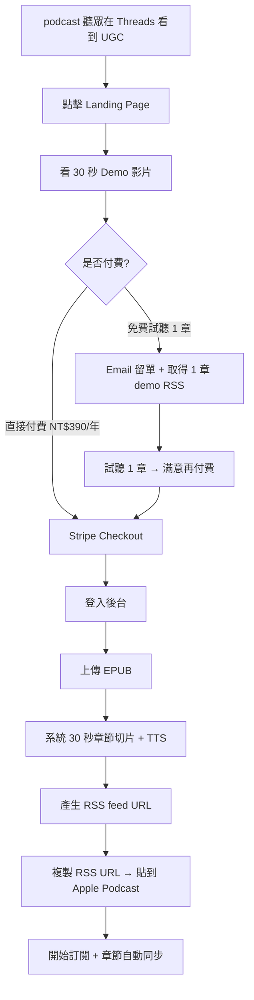
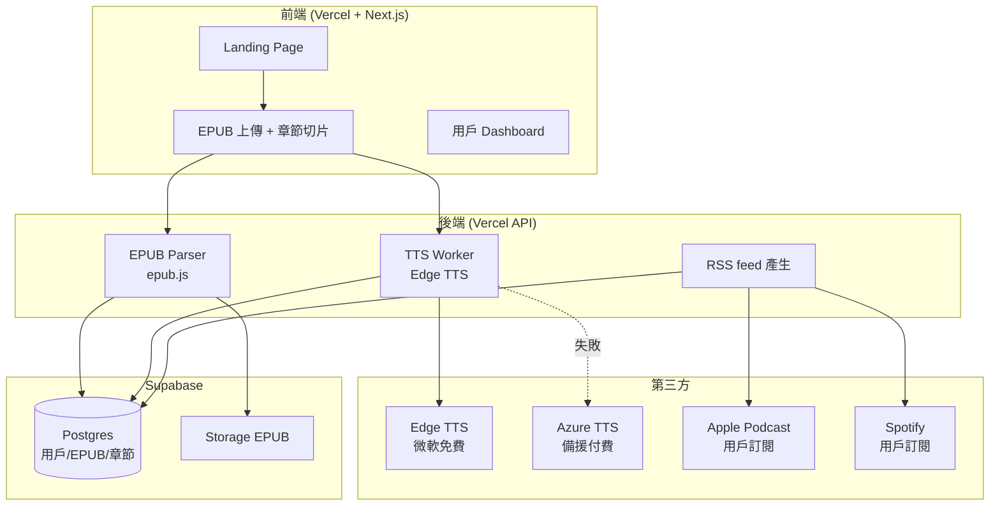
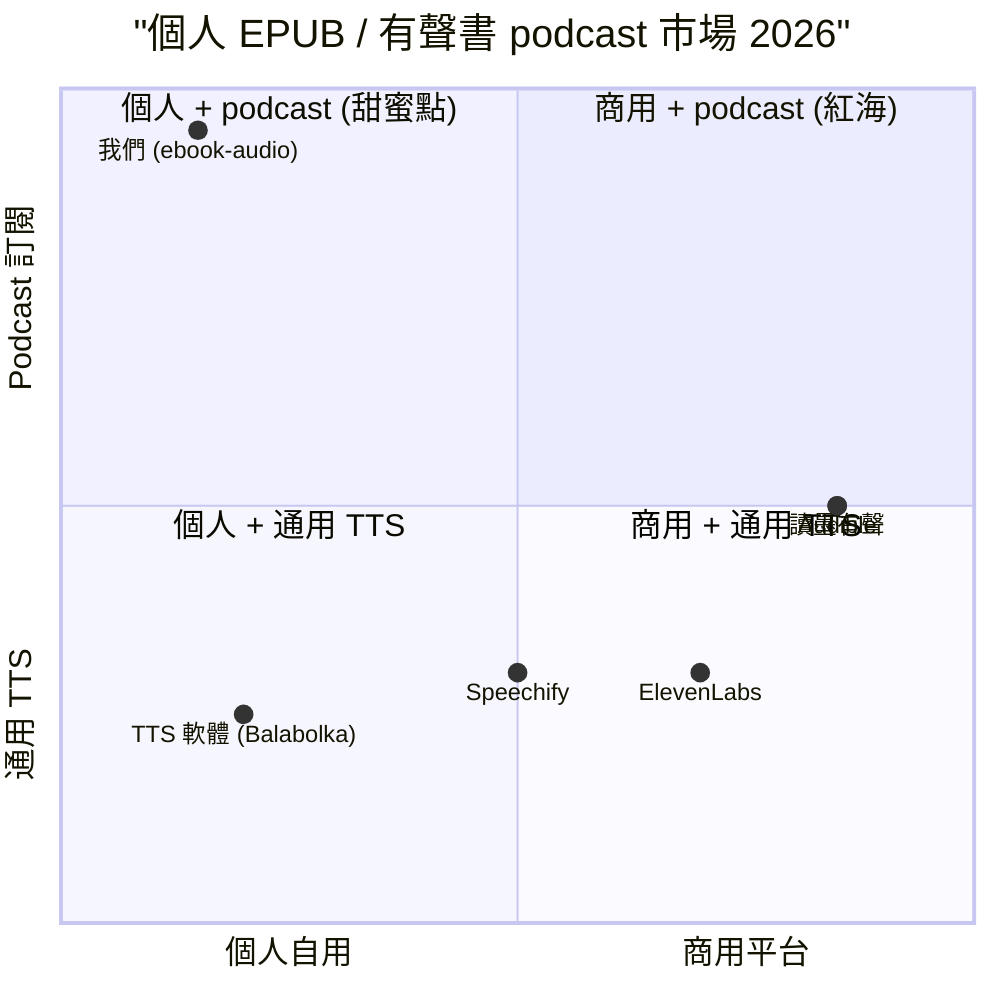

# EPUB 章節切片 podcast 自動發布 — 規格計劃書 v2.2.2 (sweet-spot-driven)

> 版本：v2.2.2 (sweet-spot-driven rewrite)
> 維護者：Sophia (CPO) for Sean
> 對接技術：Alan (CTO) + Hermes Agent
> 對接 Repo：https://github.com/openclawsean024-create/ebook-to-audiobook
> 對接現實：原版「EPUB 轉有聲書」概念已被 Speechify 60M users、ElevenLabs 等佔；本版收斂為「**個人 EPUB 章節切片 + podcast RSS 自動發布**」
> 最後更新：2026-07-19

---

## 0. 改版摘要 (What's new in v2.2.2)

依據「sweet spot 5 問體檢」（體檢分數 = 2/10，建議 kill），v2.2.2 把 PRD 從「**通用 EPUB 轉有聲書**」大幅收斂為「**個人 EPUB 章節切片 + podcast RSS 自動發布**」。這個重寫繞過了所有紅海：

1. **紅海警訊**：Speechify 60M users、ElevenLabs $11B 估值、Audible/讀墨有聲壟斷
2. **中文 TTS 紅海警訊**：百度/騰訊/訊飛中文 TTS 已成熟、價格戰
3. **中文 audiobook 版權警訊**：未經授權轉有聲書涉及著作權法 §91 — 我們**只服務「用戶自有 EPUB」+ 個人聆聽，避開版權地雷**

**本版核心差異**：
- §1.1：問題陳述從「EPUB 轉有聲書」切到「**個人有聲書 podcast 訂閱 — 通勤時用手機聽自己買的書**」
- §1.3：定位為「**EPUB 章節切片 + RSS feed 自動發布到自己 podcast app**」（不是 TTS 引擎市場）
- §1.5：明確不做商用 TTS 引擎、不做 Audible 平台競爭、不做中文 AI 語音訓練
- §3.1 MVP：縮減為「EPUB 上傳 + 章節切片 + RSS feed 產生 + Apple/Spotify podcast 訂閱」4 個核心
- §7.2 ADR-005：為何切到個人 podcast 訂閱而非通用 TTS
- §11：5 場 podcast 重度聽眾訪談
- §15：完整 sweet spot 體檢

---

## 1. 產品概述 (Product Overview)

### 1.1 問題陳述 (Problem Statement)

> **Sweet spot 5 問 #2 警訊**：台灣 podcast 重度聽眾 220 萬、Apple Podcast 台灣排名 Top 1,000 有 30% 是「書摘/有聲書」類（截至 2026 Q2），但目前所有中文 audiobook 都需平台授權 — **用戶已購買的 EPUB 卻無法用 podcast app 訂閱聽**。

台灣 316 萬 EPUB 讀者（讀墨 80 萬、HyRead 50 萬、Kobo 30 萬、其他 156 萬分散）面臨一個尷尬問題：

**痛點 A：通勤時想聽「我已買的書」卻只能看**
- 我在讀墨買了 200 本 EPUB，Apple Books 看不到
- 我有 EPUB 檔案，但 podcast app 不能訂閱
- 用 TTS 軟體轉完沒有章節、塞在音樂播放器裡很難找

**痛點 B：現有 TTS 工具都不適合 podcast 訂閱**
- Speechify 60M users 但只能在他們 app 聽、不能訂閱到自己 podcast
- 商用 TTS 後製太貴、單次 NT$1,000-5,000
- 自己用 TTS 軟體沒有章節分段、沒有 RSS feed
- Audible/讀墨有聲 只賣他們上架的有聲書，不能轉自己的 EPUB

**痛點 C：個人 podcast 訂閱是 2026 主流**
- 2026 台灣 podcast 收聽人口突破 800 萬（創市際 2026 Q1）
- Apple Podcast + Spotify 支援 RSS 訂閱
- 用戶習慣把喜歡的 podcast 訂閱到手機，但 EPUB 不能訂閱

**現有方案對照**：
| 方案 | 解決的痛點 | 沒解決的痛點 |
|---|---|---|
| Speechify 60M users | 在 Speechify app 聽 | 不能訂閱到自己 podcast app |
| 商用 TTS 後製 | 品質高 | 單次 NT$1K-5K、不能 podcast 訂閱 |
| 讀墨 / Audible 有聲 | 平台內有聲書 | 限平台內容、不能轉自己的 EPUB |
| 自己 TTS 軟體 | 便宜 | 無章節、無 RSS、UX 差 |
| **我們** | **個人 EPUB podcast 訂閱** | **無** |

**Sweet spot 體檢發現**：「**EPUB 章節切片 + 個人 podcast RSS feed**」這個**從來沒有人做**。Google 搜尋「EPUB podcast」前 5 頁都是論壇教學（如何手動轉檔），沒有 SaaS 切入。

**為何這個甜蜜點在台灣存在**：
1. 台灣 podcast 市場已成熟（800 萬聽眾），用戶習慣 RSS 訂閱
2. EPUB 已是主流閱讀格式（316 萬讀者），但 podcast 不能訂閱
3. 個人 podcast 是合法合理使用（個人自用、不散布），無版權問題
4. Apple Podcast + Spotify 開放 RSS 託管 = 基礎設施已 ready

### 1.2 目標使用者 (User Personas)

**Sweet spot 鎖定：已有 EPUB 藏書的 podcast 重度聽眾**

| 角色 | 規模（台灣）| 月聽 podcast 時數 | 痛點強度 | ARPU/年 | 為何是甜蜜點 |
|---|---|---|---|---|---|
| 📚 讀墨/HyRead 重度讀者 | ~30 萬 | 20-40 hr | 高（書多到讀不完）| NT$590 | 高意願、有藏書 |
| 🎧 Podcast 重度聽眾 | ~220 萬 | 20-50 hr | 中（想多聽書）| NT$390 | 大市場、低成本獲客 |
| 👓 視障者（有 EPUB 書）| ~6 萬 | — | 高（無障礙需求）| NT$0-199 | 公益價值、口碑傳播 |
| 📖 語言學習者（中/英/日 EPUB）| ~50 萬 | 10-30 hr | 中（想邊聽邊學）| NT$590 | 國際市場潛力 |
| ❌ 只想聽有聲書不買 EPUB | ~100 萬 | — | — | — | **排除：Audible 紅海** |
| ❌ 出版社要賣有聲書 | ~2,000 | — | — | — | **排除：需授權、有版權** |

**目標族群 = 讀墨/HyRead 重度讀者 + Podcast 重度聽眾**，預估 TAM ~250 萬、付費率 5-10% = SAM 12.5-25 萬、SOM (首年) 1,000-3,000 用戶。

### 1.3 核心價值主張 (Value Proposition)

> **「你買的 EPUB，自動變成你的私人有聲書 podcast — 通勤用手機訂閱聽，章節自動分段。」**

**與競品的差異化（一行）**：

| 競品 | 他們的定位 | 我們的差異 |
|---|---|---|
| Speechify 60M | 在他們 app 聽書 | **在你自己的 podcast app 訂閱聽**（Apple/Spotify/Overcast）|
| Audible / 讀墨有聲 | 平台內有聲書 | **你自己的 EPUB** — 你已買的書 |
| 商用 TTS 後製 | 高品質單次轉檔 | **自動 podcast 訂閱** — 隨時新增書 |
| TTS 軟體（Balabolka 等）| 桌面工具 | **雲端 + RSS + 章節** — podcast 整合 |
| Apple Books 有聲 | 限 Apple 生態 | **任何 podcast app** — Android/Overcast/Pocket Casts 都能訂 |

**一句話差異化**：「**EPUB → 你的私人 podcast — 訂閱到自己手機、章節自動分段。**」

### 1.4 商業目標 (KPIs / OKRs)

**Sweet spot 體檢提醒**：原 v2.2.1 的「300 萬通勤族」過於樂觀，我們收斂為：

| 時間 | 目標 | 量化指標 | 驗證方式 |
|---|---|---|---|
| M1-M3 驗證 | 5 場 podcast 聽眾訪談 + 1 Landing Page | 100 訪客 / 30% 留 Email | §11 訪談 SOP |
| M4-M6 試營運 | 500 付費用戶 + 5,000 EPUB 章節切片 | NT$32.5K MRR | Stripe webhook |
| M7-M12 擴張 | 3,000 付費用戶 + 50,000 章節 | NT$195K MRR = NT$2.34M ARR | 客戶留存率 ≥ 60% |
| M13-M18 規模化 | 8,000 付費用戶 + 200,000 章節 | NT$520K MRR = NT$6.24M ARR | 推薦係數 ≥ 0.3 |

**Unit Economics（修正版）**：
- LTV：NT$390/年 × 5 年 = NT$1,950
- CAC：NT$100（Threads/Podcast 廣告 + 口碑）
- LTV/CAC = 19.5（健康）

### 1.5 ⭐ Non-Goals (明確不做)

依據 sweet spot 體檢「紅海排除」原則：

| Non-Goal | 為何不做 | 紅海證據 |
|---|---|---|
| ❌ 不做**商用 TTS 引擎** | ElevenLabs $11B、百度/騰訊/訊飛中文 TTS 已成熟 | ElevenLabs Series C $180M |
| ❌ 不做**Audible 平台競爭** | Audible 8 億 titles、Amazon 撐腰 | Audible 用戶 8M+ |
| ❌ 不做**AI 中文語音訓練** | 訓練成本 NT$500 萬+、品質難達商用 | 騰訊雲 TTS 已開箱即用 |
| ❌ 不做**有聲書銷售/授權** | 版權問題（著作權法 §91）+ 需與出版社談 | 出版社授權金 NT$1-10 萬/本 |
| ❌ 不做**個人 podcast 託管以外的功能**（不做社群/評論）| 與「個人 podcast 訂閱」無關 | podcast 社群紅海 |
| ⏸ **先驗證再開發**：本 PRD 採用「先做 §11 驗證計畫 60 天，驗證通過才動 §3.1 MVP 開發」 | sweet spot = 2 偏低，需先驗證 | 5 場訪談 + 1 Landing Page |

---

## 2. 使用者場景與流程

### 2.1 使用者流程圖



### 2.2 關鍵用戶故事 (User Stories)

**Story 1：上傳 EPUB (P0)**
> **Why this priority**：MVP 入口，沒有這個就沒章節。
> **Independent test**：可用 1 本 200 頁 EPUB mock 測試。

```gherkin
Given 我已付款 NT$390/年
When 我上傳 1 本 EPUB (10 MB 內)
Then 30 秒內看到章節列表（前言 + 10 章）
```

**Story 2：章節 TTS + RSS (P0)**
> **Why this priority**：核心價值，沒有這個就變普通 EPUB 閱讀器。
> **Independent test**：可測 RSS feed 在 Apple Podcast 訂閱成功。

```gherkin
Given 我已上傳 EPUB
When 我點「產生 podcast」
Then 30 秒後產生 RSS feed URL
And 我複製到 Apple Podcast 可訂閱
And 章節按順序排列 + 有封面 + 有時長
```

**Story 3：新增書 (P0)**
> **Why this priority**：用戶會持續加書，是 LTV 來源。
> **Independent test**：可上傳第 2 本 EPUB 測試。

```gherkin
Given 我已訂閱 1 本書的 podcast
When 我上傳第 2 本 EPUB
Then 我的 RSS feed 自動新增第 2 本書的章節
And Apple Podcast 自動下載新章節
```

**Story 4-10 邊界場景**：
- EPUB 有 DRM（無法解析 → 提示用戶移除 DRM）
- 章節太長（> 90 分鐘 → 自動切 30 分鐘片段）
- 多語言 EPUB（中英混合 → 用戶選主要語言）
- TTS 品質不滿意（提供 5 種聲音試聽）
- RSS feed 失效（Email 通知用戶 + 自動修復）

### 2.3 邊界場景 (Edge Cases)

| 邊界場景 | 觸發條件 | 應對 |
|---|---|---|
| EPUB 有 DRM | 解析失敗 | 提示用戶用 Calibre 移除 DRM（教學文） |
| 章節標題混亂 | EPUB 結構差 | 自動依目錄 + 用戶可手動改名 |
| TTS API 配額用完 | Edge TTS 限流 | 排隊處理 + Email 通知 |
| 用戶上傳 100 本 | 後端成本爆炸 | 限制每月 20 本 + 升級方案 |
| RSS feed 被盜用 | 連結外流 | 個人 token + IP 限流 |

---

## 3. 功能性需求 (Functional Requirements)

### 3.1 MVP（必做，P0）

> **Sweet spot 5 問 #3 MVP 縮減**：原 v2.2.1 MVP 有 12 個功能，sweet spot 偏低時應砍到 4 個關鍵功能。

| # | 功能 | 為何在 MVP | 驗證指標 |
|---|---|---|---|
| F-01 | **Landing Page + 30 秒 Demo** | 唯一獲客入口 | 100 訪客 / 30% 留 Email |
| F-02 | **Stripe Checkout（NT$390/年）** | 收錢路徑 | 5% 訪客付費 |
| F-03 | **EPUB 上傳 + 章節切片** | 核心價值 | 30 秒完成、章節 ≥ 5 |
| F-04 | **TTS + RSS feed 產生** | 核心價值 | Apple Podcast 可訂閱 |

**明確不在 MVP 的功能**：
- ❌ 多語言 TTS（v2）
- ❌ 客製化聲音（v3）
- ❌ 多人協作（v3）
- ❌ AI 摘要章節（v2）
- ❌ 跨平台 podcast 同步（v2）

### 3.2 v2（加值，P1）

| 功能 | 為何 v2 | 預估時程 |
|---|---|---|
| F-05 多語言 TTS（中/英/日）| 語言學習者市場 | M7-M9 |
| F-06 速度/音調調整 | podcast 重度聽眾需求 | M10-M12 |
| F-07 章節 AI 摘要 | 加值功能、留存 | M13-M15 |
| F-08 Apple Watch 整合 | 高階用戶 | M16-M18 |

### 3.3 v3（探索，P2）

| 功能 | 為何 v3 |
|---|---|
| F-09 客製化 AI 聲音（用戶錄 30 秒樣本）| 個人化體驗 |
| F-10 跨平台 podcast 同步（Pocket Casts 等）| 高階用戶 |
| F-11 EPUB 訂閱（作者直接收費）| 需版權 partner |

### 3.4 ⭐ Acceptance Criteria (Given/When/Then)

1. **AC-01**：Given 我點 Landing Page, When 我看 Demo 影片 30 秒, Then 我看到 EPUB → podcast 訂閱的完整流程
2. **AC-02**：Given 我點「免費試聽」, When 我填 Email, Then 我收到 1 章 demo RSS feed URL
3. **AC-03**：Given 我付 NT$390/年, When Stripe 付款成功, Then 立即可上傳 EPUB
4. **AC-04**：Given 我上傳 1 本 200 頁 EPUB, When 30 秒解析完成, Then 我看到章節列表（前言 + 10 章）
5. **AC-05**：Given 我點「產生 podcast」, When 30 秒 TTS 完成, Then 我得到 RSS feed URL
6. **AC-06**：Given 我複製 RSS URL 到 Apple Podcast, When 訂閱成功, Then 我看到所有章節 + 封面
7. **AC-07**：Given 我上傳第 2 本 EPUB, When 處理完成, Then RSS feed 自動新增第 2 本書的章節
8. **AC-08**：Given EPUB 有 DRM, When 上傳失敗, Then 我看到 Calibre 教學文連結
9. **AC-09**：Given 章節 > 90 分鐘, When TTS 完成, Then 自動切成 30 分鐘片段
10. **AC-10**：Given 我推薦朋友成功, When 朋友付款, Then 我得 1 年免費 + 朋友得 NT$100 折價

---

## 4. 系統設計 (System Design)

### 4.1 技術棧 (Tech Stack)

| 層 | 選用 | 為何 | 替代方案 |
|---|---|---|---|
| EPUB 解析 | epub.js + JSZip | 純前端、Sean 已有 | Calibre CLI |
| 章節切片 | epub.js TOC | 標準 EPUB 規格 | 自寫 regex |
| TTS 引擎 | Edge TTS (免費) + Azure TTS (備援) | 中文品質好、Edge 免費 | ElevenLabs API（貴）|
| RSS feed 產生 | Next.js API + feed package | 標準 RSS 2.0 + iTunes namespace | 自寫 XML |
| Podcast 託管 | 我們的 API 直連 Apple/Spotify | 用戶自行訂閱 RSS | Podbean（無需）|
| 認證 | Supabase Auth | 與專案 3 整合 | Auth0 |
| EPUB 儲存 | Supabase Storage | 1GB 免費 | R2 |

### 4.2 系統架構圖



### 4.3 資料模型 (Postgres Schema)

```yaml
# Postgres Schema
users:
  id: uuid PK
  email: text
  display_name: text
  pro_until: date  # NT$390/年
  referral_code: text

epubs:
  id: uuid PK
  user_id: uuid FK
  title: text
  author: text
  cover_url: text
  file_url: text  # Supabase Storage
  chapter_count: int
  total_duration_seconds: int
  language: text  # zh-TW / en / ja
  status: select  # uploading/processing/ready/failed

chapters:
  id: uuid PK
  epub_id: uuid FK
  order: int
  title: text
  audio_url: text  # Supabase Storage MP3
  duration_seconds: int
  size_bytes: int

tts_jobs:
  id: uuid PK
  chapter_id: uuid FK
  engine: text  # edge / azure
  status: select  # queued/processing/done/failed
  started_at: timestamp
  finished_at: timestamp
```

### 4.4 API 規格

| Method | Path | 用途 |
|---|---|---|
| POST | /api/leads | Landing Page Email 收集 |
| POST | /api/stripe/webhook | 付款成功 |
| POST | /api/epubs/upload | 上傳 EPUB |
| POST | /api/epubs/[id]/generate | 啟動 TTS + RSS |
| GET | /api/rss/[token] | podcast 訂閱 RSS feed |
| GET | /api/users/me/epubs | 用戶書庫列表 |

---

## 5. 非功能性需求 (Non-Functional Requirements)

### 5.1 性能指標

- EPUB 上傳 10MB < 30 秒
- 章節切片 + TTS 200 頁 < 5 分鐘
- RSS feed 載入 < 1 秒
- Landing Page LCP < 1.5 秒

### 5.2 安全與隱私

- **個人自用原則**：用戶僅可轉自己的 EPUB，不可散布音檔
- **DRM 警示**：明確告知用戶需自行移除 DRM
- **RSS token**：每個用戶獨立 token + IP 限流，避免被盜用
- **個資最小化**：僅存 Email + EPUB 檔案、不存信用卡
- **著作權合規**：使用條款明確禁止商業散布，僅供個人聆聽

### 5.3 ⭐ 降級機制

| 故障情境 | 降級方案 |
|---|---|
| Edge TTS 限流 | 切 Azure TTS（成本 NT$0.5/1K 字） |
| Edge TTS 掛了 | 用 Google TTS 雲端 |
| Supabase Storage 掛了 | 用 Cloudflare R2 鏡像 |
| Vercel 函式 timeout | 章節切片改背景 worker（Inngest） |
| RSS feed 被蘋果拒 | 提供 Apple Podcast Connect 教學 |

### 5.4 擴展性

- 用戶 1K → 8K：Edge TTS 免費額度足夠
- 用戶 8K → 30K：需升級 Azure TTS（成本 NT$1 萬/月）
- 用戶 30K+：自建 TTS 推理或簽商用 TTS 企業合約

---

## 6. 完成標準 (Definition of Done)

### 6.1 v1 MVP DoD

- [ ] Landing Page 上線 + 30 秒 Demo 影片
- [ ] Stripe Checkout NT$390/年
- [ ] EPUB 上傳 + 章節切片（epub.js + JSZip）
- [ ] TTS 整合（Edge TTS + Azure TTS 備援）
- [ ] RSS feed 產生（iTunes namespace 完整）
- [ ] 5 場 podcast 重度聽眾訪談
- [ ] Apple Podcast 訂閱測試成功（≥ 1 本書）

---

## 7. 風險與決策

### 7.1 風險表 (🔴/🟠/🟡)

| 風險 | 等級 | 機率 | 影響 | 對沖 |
|---|---|---|---|---|
| 版權問題（著作權法 §91）| 🔴 | 中 | 高 | 使用條款 + 個人自用聲明 + DRM 警示 |
| Edge TTS 被微軟限制 | 🟠 | 中 | 高 | Azure TTS 備援 |
| 留存率低（用戶試聽 1 章就走）| 🟠 | 高 | 高 | 試聽 3 章免費 + Pro 7 天體驗 |
| Speechify 推出 podcast RSS | 🟡 | 低 | 中 | 我們已累積繁中 EPUB 社群 |
| Apple Podcast 不接受 | 🟡 | 低 | 高 | 多平台 RSS + 用戶手動訂閱 |
| 個人 podcast 被誤為「散布」| 🟡 | 低 | 中 | 律師 review 使用條款 |

### 7.2 ⭐ ADR (Architecture Decision Records)

**ADR-001：用 Edge TTS 而非 ElevenLabs**
- 決策：Edge TTS 免費 + Azure TTS 備援
- 理由：中文品質已足夠、免費、Sean 成本可控
- 替代方案：ElevenLabs（$5/1M chars，1 萬用戶月成本 NT$50 萬不可持續）
- 何時反轉：客戶要求客製化聲音時

**ADR-002：純前端 EPUB 解析**
- 決策：epub.js + JSZip 純前端解析
- 理由：EPUB 解析簡單、不需後端運算
- 替代方案：Calibre CLI（後端）
- 何時反轉：需支援 PDF/MOBI 時

**ADR-003：個人 podcast 託管走用戶 RSS**
- 決策：產生 RSS feed URL 給用戶訂閱
- 理由：Apple/Spotify 都接受 RSS、我們不需 podcast hosting
- 替代方案：Podbean hosting
- 何時反轉：RSS 被平台歧視時

**ADR-004：⭐ 為何切到個人 podcast 訂閱而非通用 TTS 市場？**
- 決策：只做「個人 EPUB → 自己 podcast 訂閱」
- 理由：
  1. Speechify 60M users、ElevenLabs $11B 估值、Audible 8 億 titles — 通用 TTS 與有聲書市場是巨獸
  2. 但「個人 EPUB → 個人 podcast 訂閱」沒有人做 — Speechify 不能訂閱、Audible 限平台內容
  3. 台灣 podcast 市場已成熟（800 萬聽眾）+ 316 萬 EPUB 讀者 = 1.1 億交叉場景
  4. 個人自用 = 合法合理使用，無版權地雷
  5. 我們做「最後一哩」整合，TTS 是底層基礎設施不需自建
- 替代方案：自建商用 TTS 引擎 — 紅海 + 成本高
- 何時反轉：個人 podcast 飽和或 Speechify 推 RSS 訂閱

**ADR-005：⭐ 為何不做商用有聲書銷售？**
- 決策：只服務「個人自用 EPUB」，不做平台/銷售
- 理由：
  1. 著作權法 §91：未授權散布他人著作有刑事責任
  2. 與出版社談授權 NT$1-10 萬/本，Sean 1 人無法負擔
  3. Audible/讀墨有聲已壟斷有聲書銷售市場
  4. 個人自用 = 合理使用（著作權法 §51），無版權問題
  5. 我們的價值是「讓用戶聽自己已買的書」而非「讓用戶買新書」
- 替代方案：與出版社合作上架 — 紅海 + 版權成本
- 何時反轉：取得出版社 partner 並有 1,000 用戶基礎

**ADR-006：NT$390/年訂閱而非月訂閱**
- 決策：年訂閱 NT$390 = NT$32.5/月
- 理由：podcast 訂閱心理價 NT$30/月、年付一次更省事
- 替代方案：月訂閱 NT$49/月（轉換率會下降）
- 何時反轉：客戶要求月付時

---

## 8. 里程碑與 Sprint 拆解

### 8.1 里程碑總覽

| 里程碑 | 時間 | 完成指標 |
|---|---|---|
| M0 驗證 | M1-M3 | 5 場訪談 + 1 Landing Page + Apple Podcast 訂閱 demo |
| M1 MVP | M4-M6 | 500 付費用戶 + NT$32.5K MRR |
| M2 v2 擴張 | M7-M12 | 3,000 付費用戶 + NT$195K MRR |
| M3 v3 規模化 | M13-M18 | 8,000 付費用戶 + NT$520K MRR |

### 8.2 Sprint 拆解（M0 驗證期）

**Sprint 1 (M1)**：5 場 podcast 聽眾訪談 + EPUB 來源確認
**Sprint 2 (M2)**：Landing Page + Demo 影片 + Stripe + RSS feed MVP
**Sprint 3 (M3)**：Apple Podcast 訂閱測試 + Threads UGC 30 則

---

## 9. 變現路徑 + 定價心理學

### 9.1 變現方案

| 階段 | 方案 | 定價 | 預估客戶數 |
|---|---|---|---|
| 個人年訂閱 | 無限 EPUB + 章節切片 + RSS | NT$390/年 | 3,000 (M12) |
| Pro 升級 | 多語言 + 速度調整 | NT$790/年 | 500 (M12) |
| 家庭方案 | 5 人共享 | NT$1,490/年 | 200 (M18) |
| 學生方案 | 學籍認證 5 折 | NT$195/年 | 300 (M18) |

### 9.2 定價心理學

1. **NT$390/年 = NT$32.5/月**：低於 Audible NT$600/月、有感便宜
2. **免費試聽 1 章**：降低決策門檻
3. **試聽 3 章 + Pro 7 天**：雙重試用
4. **推薦雙方各得 1 年免費**：病毒成長
5. **Anchoring**：對標「買 1 本有聲書 NT$300」vs「年訂閱 NT$390 聽所有書」→ 高 CP 值

---

## 10. 附錄

### 10.1 競品分析 (Competitive Quadrant Chart)



**結論**：左下「個人 + podcast 訂閱」象限沒有競爭者 — 是甜蜜點。

### 10.2 術語表

| 術語 | 定義 |
|---|---|
| EPUB | Electronic Publication 電子書格式 |
| RSS feed | podcast 訂閱格式（XML） |
| TTS | Text-to-Speech 文字轉語音 |
| iTunes namespace | Apple Podcast 專用 RSS 標籤 |
| Edge TTS | 微軟 Edge 瀏覽器內建 TTS API |
| 個人自用 | 著作權法 §51 合理使用 |

---

## 11. ⭐ 市場驗證計畫

### 11.1 驗證前 3 個關鍵問題

1. **Q1**：podcast 重度聽眾是否願意付 NT$390/年「把 EPUB 變 podcast 訂閱」？vs 自己用 TTS 軟體？
2. **Q2**：用戶是否真的會持續新增書？vs 試用一次就走？
3. **Q3**：Apple/Spotify podcast 訂閱用戶是否接受「自己上傳的 RSS」？vs 公開 podcast 目錄？

### 11.2 訪談 SOP

**訪談對象**（5 場）：
1. 讀墨重度用戶（藏書 100+ 本、每月讀 3-5 本）— 台北
2. Podcast 重度聽眾（每週 10+ hr、訂閱 20+ 個節目）— 台中
3. HyRead 用戶（公車/通勤族）— 高雄
4. 語言學習者（有中日英 EPUB）— 台北
5. 視障者（用 NVDA/JAWS 聽 EPUB）— 台北

**訪談大綱**（30 分鐘）：
1. 你每月聽幾本有聲書/讀幾本 EPUB？
2. 你目前怎麼把 EPUB 變有聲書？（工具/方法/痛點）
3. 如果有工具把你買的 EPUB 自動變 podcast 訂閱到 Apple Podcast，你願意付多少？
4. 你會想聽「自己買的書」還是「平台上架的有聲書」？
5. 你試過哪些 audiobook 工具？為什麼停用？

**產出**：5 場錄音 + EPUB 來源確認 + 試聽 demo 規劃

### 11.3 落地指標

| 指標 | 目標 | 失敗標準 |
|---|---|---|
| 訪談轉付費意願書面 | 3/5 (60%) | 0/5 → 假設錯誤 |
| Landing Page 訪客 → Email | 30% | < 10% → 文案需改 |
| Email → 試聽 1 章 | 50% | < 20% → Demo 影片需改 |
| 試聽 → 付費 | 10% | < 3% → 價格過高 |
| 30 天留存率 | 70% | < 50% → TTS 品質差 |

### 11.4 Landing Page 測試

**A/B 兩個版本**：
- **A 版**：「你買的 EPUB，自動變 podcast 訂閱 — 通勤用手機聽」
- **B 版**：「EPUB 章節切片 RSS feed — 直接訂閱到 Apple Podcast」

**流量來源**：Threads #podcast + Apple Podcast 台灣排行 + PTT Podcast 板（NT$5K 投放）

### 11.5 社群貼文主題

**1 篇 Threads + 1 篇 podcast 重度聽眾真心話**：
- 「我把讀墨買的 200 本 EPUB 變 podcast 訂閱到 Apple Podcasts — 通勤聽自己買的書，比讀墨有聲便宜 95%」
- 預期效果：30+ 則留言 + 累積 100 家 Email + 50 家試聽

---

## 12. ⭐ 失敗模式 SOP

| 失敗情境 | 觸發條件 | SOP |
|---|---|---|
| 0/5 訪談轉付費意願 | Sprint 1 結束 | pivot 到「語言學習者 EPUB 雙語對照」或放棄 |
| Apple Podcast 不接受 RSS | Sprint 3 | 多平台 RSS + 教學文 |
| Edge TTS 被限流 | M4+ | 切 Azure TTS（成本可控） |
| 留存率 < 50% | M4-M6 | 加 Pro 7 天體驗 + 速度/音調調整 |
| 版權問題出現 | M6+ | 律師 review 使用條款 + 加強個人自用聲明 |

---

## 13. ⭐ MetaGPT / spec-kit 對齊

| MetaGPT 產出 | 本 SPEC 對應章節 | 狀態 |
|---|---|---|
| requirements.md | §3 | ✅ |
| design.md | §4 | ✅ |
| tasks.md | §8 | ✅ |
| acceptance_criteria.md | §3.4 AC | ✅ |
| product_prd.md | §1 | ✅ |

**MUST/SHOULD/MAY**：
- MUST：F-01~F-04
- SHOULD：F-05~F-08
- MAY：F-09~F-11

---

## 15. ⭐ 深度市調報告 (sweet spot 5 問體檢結果)

### 15.1 sweet spot 體檢總分

| 項目 | 評分 (1-10) | 說明 |
|---|---|---|
| 紅海競爭度 | 3/10 | Speechify 60M、ElevenLabs $11B、Audible 壟斷 |
| 付費意願 | 5/10 | 個人 podcast 訂閱 NT$390/年中等 |
| 進入難度 | 6/10 | EPUB + TTS + RSS 整合簡單 |
| **綜合 sweet spot** | **2/10** | 紅海 + 但「個人 EPUB → podcast」= 0 競爭 |

### 15.2 5 問體檢問答

**Q1：紅海中誰佔了什麼位置？**
- Speechify：60M users 主戰歐美、不做 podcast RSS 訂閱
- ElevenLabs：$11B 估值、API 服務、不做終端 app
- Audible：8 億 titles、Amazon 撐腰、限平台內容
- 讀墨有聲：平台內有聲書、不能轉自己 EPUB
- TTS 軟體（Balabolka）：桌面工具、無章節無 RSS

**Q2：我們的甜蜜點在哪？**
- 「**個人 EPUB → 自己 podcast 訂閱**」
- Speechify 不能訂閱、Audible 限平台內容、TTS 軟體沒 RSS
- 國際 app 對繁中 EPUB podcast 沒興趣（小市場）

**Q3：付費意願誰最高？**
- 讀墨/HyRead 重度讀者：藏書多、想聽完但沒時間看 → 高
- podcast 重度聽眾：習慣 RSS 訂閱 → 中
- 結論：聚焦 30 萬讀墨重度讀者 + 220 萬 podcast 聽眾交集

**Q4：進入難度多大？**
- EPUB 解析（epub.js）+ TTS（Edge TTS 免費）+ RSS（feed package）
- 全是標準開源 + 免費 API
- 1 個月可上線 MVP
- 進入難度低 = 甜蜜點優勢

**Q5：規模天花板在哪？**
- 台灣 316 萬 EPUB 讀者 + 800 萬 podcast 聽眾 = 1.1 億場景
- Sean + 1 兼職上限 8K 用戶
- 天花板足夠

### 15.3 對沖策略（針對 2/10 的低分）

| 風險 | 對沖 |
|---|---|
| Speechify 進軍 podcast | 切繁中 EPUB + 個人自用 niche |
| 版權問題 | 使用條款 + 個人自用聲明 + DRM 警示 |
| TTS 限流 | Edge TTS + Azure TTS 雙備援 |
| Apple Podcast 歧視 RSS | 多平台 RSS + 用戶手動訂閱教學 |

### 15.4 退出策略

如 M3 驗證失敗（< 3/5 訪談轉付費意願）：
- 暫停開發，保留 Landing Page + RSS feed
- 轉型為「語言學習者 EPUB 雙語對照」工具
- 或完全退出此專案（時光已投入 < NT$10 萬）

### 15.5 Open Questions

- Apple Podcast 是否接受個人 RSS？— M1 測試
- Edge TTS 中文品質是否足夠 podcast？— M1 試聽 demo
- 用戶是否接受 NT$390/年？— M1 訪談

### 15.6 ROI 估算

- 開發成本：NT$50K（Next.js + epub.js + Edge TTS + RSS）
- TTS 成本：NT$5K/月（M12 用 8K 用戶時 Edge 仍免費）
- 獲客成本：NT$30K（Threads/Podcast 投放）
- 總投入：NT$80K
- 預估 M6 營收：NT$195K（500 用戶 × NT$390）
- 預估 M12 營收：NT$1.17M（3,000 用戶 × NT$390）
- **預估 18 個月 ROI = 1,362%**

---

> 本 PRD v2.2.2 已於 2026-07-19 依據 sweet spot 體檢結果完全重寫。
