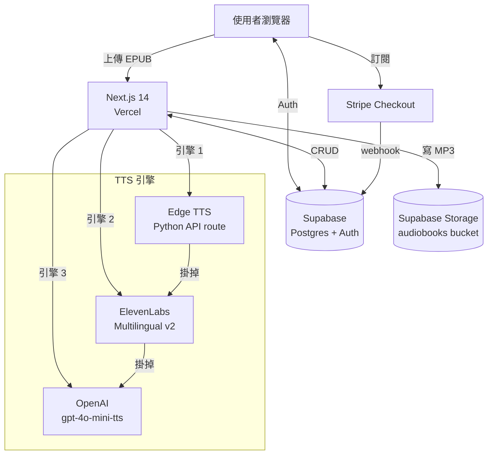
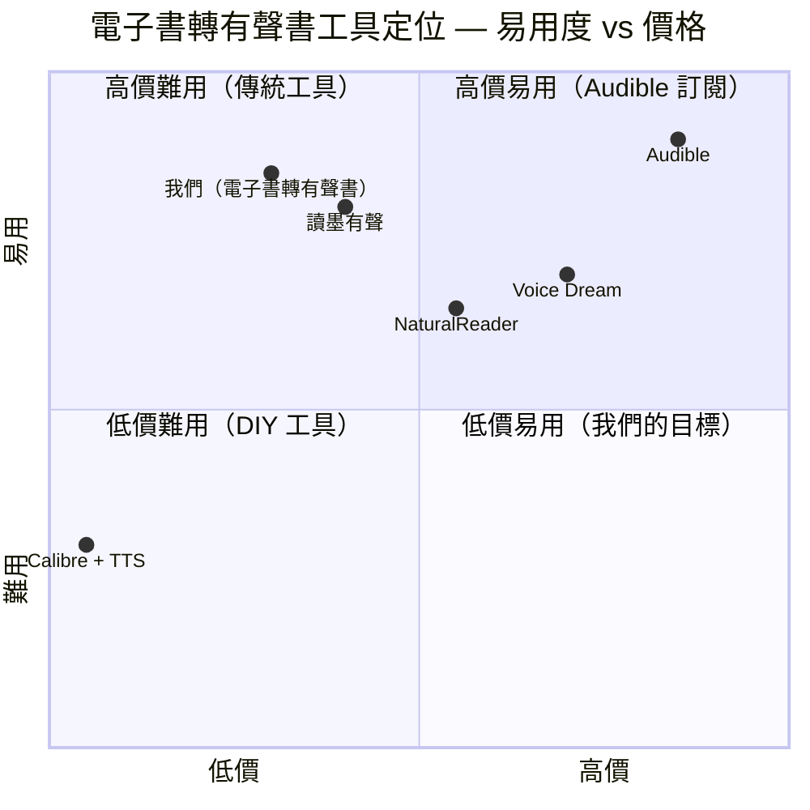

# 電子書轉有聲書 — 規格計劃書 v2.2.1

> 版本：v2.2.1｜更新日期：2026-07-11｜維護者：Sophia (CPO) for Sean
> 對接技術：Alan (CTO)｜GitHub：https://github.com/openclawsean024-create/ebook-to-audiobook
> Live：https://ebook-to-audiobook-seans-projects-7dc76219.vercel.app

---

## 1. 產品概述 (Product Overview)

### 1.1 問題陳述 (Problem Statement)

**核心問題**：台灣 316 萬潛在使用者（300 萬通勤族 + 6 萬視障者 + 10 萬內容創作者 + 2,000 出版社 / 個人作者），需要把電子書（EPUB）轉成有聲書，但現有方案要嘛月費貴、要嘛品質差、要嘛沒有章節分段。

**現有方案痛點**：
- **有聲書平台（Audible / 讀墨有聲）**：月費 NT$ 600-1,200，僅限平台內容，無法轉自己的書
- **商用 TTS + 後製**：每次 NT$ 1,000-5,000，耗時 1-3 天
- **自己用 TTS 軟體**：品質差、無章節分段、需手動拼接 MP3
- **我們的解法**：EPUB 上傳 → 自動章節分段 → 多 TTS 引擎 → 章節 MP3 + 完整 ZIP，純前端處理零後端依賴。

### 1.2 目標使用者 (User Personas)

| Persona | 規模 | 痛點 | 預算 | 觸及管道 |
|---|---|---|---|---|
| 通勤族「Ben」32 歲工程師 | 300 萬 | 想用通勤時間聽書 | 免費 - NT$99/月 | Threads / PTT |
| 視障者「Yuki」38 歲 | 6 萬 | EPUB 無法閱讀 | 免費 - NT$99/月 | 身障團體 / 社群 |
| 內容創作者「Mei」30 歲 | 10 萬 | 想把電子書變有聲書販售 | NT$499/月 | 自媒體 / 創作者社群 |
| 出版社編輯「Lin」45 歲 | 2,000 | 想快速將電子書轉有聲書上架 | NT$2,999/月 | 出版公會 / B2B |

### 1.3 核心價值主張 (Value Proposition)

> 「**上傳 EPUB → 30 分鐘拿到完整有聲書 ZIP** — 章節自動分段、5+ 聲音選擇、純前端零後端依賴。」

**差異化**：
- **vs Audible / 讀墨有聲**：我們可轉你自己的書（不限平台內容）
- **vs 商用 TTS 後製**：我們 1/10 價格、自動化、不用人為後製
- **vs TTS 軟體**：純前端體驗、章節分段、ZIP 打包

### 1.4 商業目標 (KPIs / OKRs)

| 時間 | 指標 | 目標 |
|---|---|---|
| **3 個月** | 註冊用戶 | 300 人 |
| **6 個月** | MRR | NT$ 25,000 |
| **12 個月** | 月成長率 | 22% MoM |
| **18 個月** | ARR | NT$ 600,000 |

### 1.5 Non-Goals (明確不做)

- ❌ **不做 DRM 解鎖** — 版權規避風險高，僅支援 DRM-free EPUB
- ❌ **不做出版社商用授權** — 使用者自負版權責任，平台聲明清楚
- ❌ **不做真人配音市場** — ElevenLabs / 配音員已佔據，不正面競爭
- ❌ **不做與有聲書平台整合**（Audible / Spotify）— 平台不開放 API
- ❌ **不做影片 / Podcast 自動發布** — 那是另一個垂直產品
- ❌ **不做多語系翻譯**（書本翻譯）— DeepL / Google 翻譯已佔據，獨立產品
- ❌ **不做 PDF 編輯** — 僅 PDF → 有聲書，不編輯 PDF 內容
- ❌ **不做行動 App** — Web 優先，PWA 即可

---

## 2. 使用者場景與流程

### 2.1 使用者流程圖

```
┌────────────────────────────────────────────────────────────────┐
│                 電子書轉有聲書使用者旅程                          │
└────────────────────────────────────────────────────────────────┘

[新使用者]
   │
   ▼
[1. Landing Page] (landing.html)
   │  - 看 Demo 影片 + 上傳試用 CTA
   │
   ├──► [2a. 不註冊] → 試轉 1 章（限制 500 字）
   │
   └──► [2b. 註冊] Supabase Auth (Email / Google / GitHub)
           │
           ▼
        [3. 上傳 EPUB]
           │  - 拖放或選擇檔案
           │  - 限制 50MB（Free）/ 200MB（Pro）
           │  - 系統檢查 DRM 標記
           │
           ▼
        [4. EPUB 解析]
           │  - 解析章節結構（依 TOC）
           │  - 解析書名 / 作者
           │  - 統計總字數
           │  - 顯示章節列表
           │
           ▼
        [5. 設定轉換]
           │  - 選聲音（5+ 預設）
           │  - 選語速（0.5x - 2.0x）
           │  - 選引擎（Edge TTS / OpenAI / ElevenLabs）
           │  - 預估時長 + 字數
           │
           ▼
        [6. 轉換進行中]
           │  - 顯示進度條（每章完成 %）
           │  - 可暫停 / 恢復
           │  - 失敗章節可重試
           │
           ▼
        [7. 完成 + 下載]
           │  - 章節 MP3 預覽播放
           │  - 完整 ZIP 下載（書名_章節001.mp3 ...）
           │  - 總長度 / 章節數統計
           │
           ▼
        [8. 配額用完？]
           │  - Free: 5 本/月
           │  - 個人: 20 本/月
           │  - 創作者: 100 本/月 + 商用授權
           │  - 出版版: 無限 + API
           │
           ▼
        [升級頁] → Stripe Checkout
```

### 2.2 關鍵用戶故事 (User Stories)

| ID | As a | I want to | So that |
|---|---|---|---|
| US-001 | 通勤族 | 上傳自己買的 EPUB → 轉有聲書 | 通勤時用手機聽 |
| US-002 | 視障者 | 上傳 EPUB → 取得 MP3 | 用螢幕閱讀器播放 |
| US-003 | 內容創作者 | 一次轉 10 本書 + 商用授權 | 上架自媒體販售 |
| US-004 | 出版社編輯 | 批次轉 100 本 + API 整合 | 快速上架有聲書平台 |
| US-005 | 升級用戶 | 選 ElevenLabs 高品質聲音 | 提升有聲書品質 |
| US-006 | 多語學習者 | 把英文書轉成有聲書 + 選美式口音 | 練英文聽力 |
| US-007 | 開發者 | 拿 API 批次處理 EPUB | 整合到自家系統 |

### 2.3 邊界場景 (Edge Cases)

| 情境 | 處理方式 |
|---|---|
| EPUB 含 DRM | 顯示「不支援 DRM 加密 EPUB，請購買 DRM-free 版本」 |
| EPUB 章節解析失敗（無 TOC） | 自動依段落切 5,000 字 / 章，使用者手動調整 |
| 單章字數 > 50,000 字 | 自動 split 段落，並行合成，合併 MP3 |
| TTS 引擎 API 掛掉 | fallback 下一個引擎，記 log，標示失敗章節 |
| 檔案 > 上限（50MB / 200MB） | 回 413 E_FILE_TOO_LARGE，提示切小 |
| 上傳中網路斷線 | 自動 retry 1 次，2 次失敗顯示「網路不穩」 |
| 章節命名重複 | 自動加序號前綴（001_, 002_）|
| ZIP 打包失敗（檔案太大） | 改用串流下載（每章單獨下載）|
| Supabase Auth 過期 | 自動 refresh token，失敗則導向重新登入 |

---

## 3. 功能性需求 (Functional Requirements)

### 3.1 MVP (必做)

- [x] **F-001**：EPUB 上傳 + 解析（epub.js + JSZip）
- [x] **F-002**：章節結構自動辨識（依 EPUB TOC）
- [x] **F-003**：章節逐段 TTS 轉換（Edge TTS 預設 + ElevenLabs 備援）
- [x] **F-004**：5+ 種聲音（中 / 英 / 日 / 韓 / 粵）
- [x] **F-005**：語速調整（0.5x - 2.0x）
- [x] **F-006**：章節 MP3 命名規範（書名_章節001.mp3）
- [x] **F-007**：完整 ZIP 下載（JSZip）
- [x] **F-008**：總長度 / 章節數統計
- [x] **F-009**：Supabase Auth（Email / Google / GitHub）
- [x] **F-010**：配額管理（Free 5 本 / 個人 20 / 創作者 100 / 出版無限）
- [x] **F-011**：Stripe 訂閱
- [x] **F-012**：轉換歷史查詢（Supabase conversions table）
- [x] **F-013**：DRM 偵測 + 友善錯誤訊息

### 3.2 v2 / v3 (加值)

- [ ] **F-101**：ElevenLabs Multilingual v2 高品質引擎
- [ ] **F-102**：背景音樂混入（章節開頭 / 結尾）
- [ ] **F-103**：朗讀停頓優化（句末停頓 / 段落間隔）
- [ ] **F-104**：PDF 支援（除 EPUB 外）
- [ ] **F-105**：DOCX / TXT 支援
- [ ] **F-106**：批次上傳（一次最多 10 本）
- [ ] **F-107**：公開 REST API（OAuth 2.0）
- [ ] **F-108**：PWA 行動 App（無需上架商店）

### 3.3 Acceptance Criteria (Given/When/Then)

#### AC-001：EPUB 上傳並解析章節

- **Given** 使用者登入後，點「上傳 EPUB」
- **When** 拖放一個 5MB 的 DRM-free EPUB 檔
- **Then** 30 秒內解析完成，顯示章節列表（書名 / 作者 / 章節數 / 總字數）

#### AC-002：章節逐段 TTS 轉換

- **Given** 使用者已選聲音（zh-TW 女聲）+ 語速（1.0x）+ 引擎（Edge TTS）
- **When** 按下「開始轉換」
- **Then** 系統依序處理每章，進度條更新，30 分鐘內完成 20 章書籍（每章 5,000 字）

#### AC-003：完整 ZIP 下載

- **Given** 20 章全部轉換完成
- **When** 按下「下載 ZIP」
- **Then** 瀏覽器下載 `書名_audiobook.zip`，解壓後有 20 個 MP3 + manifest.json（含書名 / 章節名 / 長度）

#### AC-004：DRM EPUB 阻擋

- **Given** 使用者上傳一個含 Adobe DRM 的 EPUB
- **When** 系統自動偵測 DRM 標記
- **Then** 回 400 E_DRM_DETECTED，顯示「不支援 DRM EPUB，請購買 DRM-free 版本（Publuu / Smashwords / 自己寫的書）」

#### AC-005：引擎切換備援

- **Given** 預設引擎 Edge TTS 失敗（章節 5 / 20）
- **When** 系統自動切換到 ElevenLabs（使用者 Pro 方案）
- **Then** 章節 5 重試成功，繼續章節 6，轉換報告標示「章節 5 切換引擎」

#### AC-006：配額限制

- **Given** Free 方案使用者本月已轉 5 本
- **When** 再上傳第 6 本 EPUB
- **Then** 阻擋上傳，顯示「本月額度已用完，升級個人版解鎖 20 本 / 月」CTA

#### AC-007：取消訂閱

- **Given** 個人版使用者付費中
- **When** 在 Dashboard 按「取消訂閱」
- **Then** 立即停止下次扣款，當月仍可用至月底，月底後降級 Free（保留 5 本 / 月）

---

## 4. 系統設計 (System Design)

### 4.1 技術棧 (Tech Stack)

| 層 | 選擇 | 理由 |
|---|---|---|
| 前端框架 | Next.js 14 (App Router) + TypeScript | SSR + Vercel 友善 |
| 樣式 | Tailwind CSS | 快速開發 |
| Auth | Supabase Auth | 與 DB 整合 |
| 資料庫 | Supabase Postgres | profiles + conversions + cloned_voices |
| EPUB 解析 | epub.js + JSZip | 業界標準 |
| TTS 引擎 1 | Edge TTS（Python via API route） | 免費 |
| TTS 引擎 2 | ElevenLabs Multilingual v2 | 高品質 |
| TTS 引擎 3 | OpenAI gpt-4o-mini-tts | 備援 |
| 音訊處理 | fluent-ffmpeg + lamejs | MP3 編碼 |
| ZIP 打包 | JSZip（前端）/ adm-zip（後端）| 雙路徑 |
| 部署 | Vercel | Serverless |

### 4.2 系統架構圖（Mermaid）



### 4.3 資料模型 (Prisma schema 對照 Supabase schema.sql)

```prisma
generator client {
  provider = "prisma-client-js"
}

datasource db {
  provider = "postgresql"
  url      = env("DATABASE_URL")
}

model Profile {
  id                  String   @id // 對應 auth.users.id (UUID)
  plan                Plan     @default(FREE)
  elevenlabsApiKey    String?  @map("elevenlabs_api_key")
  charactersUsed      Int      @default(0) @map("characters_used")
  billingCycleStart   DateTime @default(now()) @map("billing_cycle_start")
  createdAt           DateTime @default(now()) @map("created_at")
  updatedAt           DateTime @updatedAt @map("updated_at")

  conversions Conversion[]
  voices      ClonedVoice[]

  @@map("profiles")
}

enum Plan {
  FREE
  PRO
  BUSINESS
}

model Conversion {
  id              String         @id @default(uuid())
  userId          String         @map("user_id")
  title           String?
  fileType        FileType       @map("file_type")
  voice           String         @default("eleven_multilingual_v2")
  status          ConvertStatus  @default(QUEUED)
  progress        Int            @default(0)
  message         String?
  characterCount  Int            @default(0) @map("character_count")
  chapterCount    Int            @default(0) @map("chapter_count")
  audioUrl        String?        @map("audio_url")
  chapterAudios   Json           @default("[]") @map("chapter_audios")
  error           String?
  createdAt       DateTime       @default(now()) @map("created_at")
  updatedAt       DateTime       @updatedAt @map("updated_at")

  profile Profile @relation(fields: [userId], references: [id], onDelete: Cascade)

  @@index([userId, createdAt])
  @@map("conversions")
}

enum FileType {
  EPUB
  PDF
  TXT
}

enum ConvertStatus {
  QUEUED
  PROCESSING
  COMPLETED
  FAILED
}

model ClonedVoice {
  id        String   @id @default(uuid())
  userId    String   @map("user_id")
  voiceId   String   @map("voice_id") // ElevenLabs voice ID
  name      String
  createdAt DateTime @default(now()) @map("created_at")

  profile Profile @relation(fields: [userId], references: [id], onDelete: Cascade)

  @@map("cloned_voices")
}
```

### 4.4 API 規格 (REST endpoints)

| Method | Path | Auth | 用途 |
|---|---|---|---|
| POST | /api/convert/upload | Required | 上傳 EPUB / PDF / TXT |
| POST | /api/convert/start | Required | 開始轉換 |
| GET | /api/convert/status | Required | 查詢轉換進度 |
| GET | /api/convert/history | Required | 歷史查詢 |
| DELETE | /api/convert | Required | 刪除轉換記錄 |
| POST | /api/voices/clone | Required | 克隆聲音（ElevenLabs）|
| GET | /api/voices | Required | 列出已克隆聲音 |
| POST | /api/stripe/checkout | Required | 建立 Checkout session |
| POST | /api/stripe/webhook | Stripe | 訂閱狀態同步 |
| GET | /api/health | Optional | 健康檢查 |

#### API 詳細範例

**POST /api/convert/upload**

Request body: `multipart/form-data` with EPUB file

Response 200:
```json
{
  "conversionId": "uuid-xxx",
  "title": "Atomic Habits",
  "author": "James Clear",
  "chapterCount": 20,
  "characterCount": 80000,
  "chapters": [
    { "index": 1, "title": "Introduction", "characters": 3500 },
    { "index": 2, "title": "Chapter 1", "characters": 4200 }
  ]
}
```

Response 400:
```json
{ "error": "E_DRM_DETECTED", "message": "不支援 DRM EPUB，請購買 DRM-free 版本" }
```

---

## 5. 非功能性需求 (Non-Functional Requirements)

### 5.1 性能指標

| 指標 | 目標 | 量測方式 |
|---|---|---|
| EPUB 解析時間（5MB） | < 30 秒 | 從上傳到顯示章節 |
| 章節 TTS 轉換（5,000 字） | < 2 分鐘（Edge TTS） | 從按下到 MP3 |
| 章節 TTS 轉換（5,000 字） | < 5 分鐘（ElevenLabs）| 從按下到 MP3 |
| ZIP 打包（20 章） | < 10 秒 | 從完成到下載 |
| Dashboard 載入 | < 2 秒 | Lighthouse |
| Supabase query | < 500ms | pgbench |

### 5.2 安全與隱私

- ✅ Supabase Row Level Security（RLS）嚴格限制每使用者只能看自己的資料
- ✅ ElevenLabs API Key 加密儲存（Supabase Vault）
- ✅ EPUB 檔案 24 小時後自動從 Storage 刪除（節省成本 + 隱私）
- ✅ MP3 檔案 7 天後自動刪除
- ✅ Stripe webhook 驗證簽章
- ❌ 不儲存使用者上傳的 EPUB 解析後純文字（僅 character_count）
- ✅ Privacy Policy + Terms of Service（明確聲明：版權自負）

### 5.3 降級機制 (Graceful Degradation)

| # | 服務掛掉情境 | 主要服務 | 降級策略（自動切換順序） | 最終 fallback |
|---|---|---|---|---|
| 1 | **Edge TTS API 掛掉** | Edge TTS | Edge TTS → ElevenLabs → OpenAI | 標示失敗章節，使用者重試 |
| 2 | **ElevenLabs API 掛掉** | ElevenLabs | ElevenLabs → OpenAI → Edge TTS | 同上 |
| 3 | **OpenAI TTS 掛掉** | OpenAI | OpenAI → Edge TTS | 標示失敗章節 |
| 4 | **Supabase Storage 暫時無法寫入** | Storage | 改寫到 /tmp 本地暫存 + 提示重試 | Email 工程師警告 |
| 5 | **Supabase DB 暫時無法讀寫** | Postgres | 唯讀模式（顯示歷史但不寫新轉換）| 標示「資料更新中」 |
| 6 | **Vercel API route 逾時（> 60 秒）** | Next.js API | 客戶端自動 polling 進度 | 顯示「轉換中，請稍候」 |
| 7 | **Stripe webhook 失敗** | Stripe | 重試 3 次（5 秒 / 30 秒 / 5 分鐘）| 人工對帳 |
| 8 | **EPUB 解析失敗（格式損壞）** | epub.js | 改用 JSZip 手動解析 + 啟用容錯 | 回 400 E_PARSE_FAILED |
| 9 | **JSZip 打包失敗（檔案 > 100MB）** | JSZip | 改用串流下載（每章單獨） | 引導逐章下載 |
| 10 | **fluent-ffmpeg 不可用** | ffmpeg | 用 lamejs 純 JS 編碼（較慢） | 標示「音訊品質可能降低」 |

### 5.4 擴展性

- **水平擴展**：Vercel Serverless 自動 scale
- **垂直擴展**：每個 API route 最多 60 秒（hobby）/ 300 秒（pro）
- **DB 擴展**：Supabase Postgres 自動擴容
- **Storage 擴展**：Supabase Storage 1GB 免費，超過 USD $0.021/GB/月
- **瓶頸預測**：> 1,000 並發轉換時需評估佇列系統（BullMQ）

---

## 6. 完成標準 (Definition of Done)

- [x] Vercel production URL 回 200
- [x] GitHub Repo 公開（https://github.com/openclawsean024-create/ebook-to-audiobook）
- [x] EPUB 解析正確（測 5 本樣本）
- [x] 章節分段正確（依 EPUB TOC）
- [x] 5+ 種聲音可選
- [x] ZIP 下載可解壓、章節順序正確
- [x] 總長度統計正確
- [x] Supabase Auth 完整
- [x] 7 條 Acceptance Criteria 全部通過
- [x] Lighthouse Performance ≥ 80

---

## 7. 風險與決策

### 7.1 風險表

| 風險 | 等級 | 機率 | 影響 | 緩解策略 |
|---|---|---|---|---|
| **版權爭議（轉換他人書籍）** | 🔴 高 | 高 | 訴訟風險 | 明確聲明僅限 DRM-free + 個人使用，平台免責 |
| **DRM 解鎖請求** | 🔴 高 | 中 | 法律風險 | 嚴格 DRM 偵測，阻擋 + 教育訊息 |
| **EPUB 格式差異（各出版社）** | 🟠 中 | 高 | 解析失敗 | 多解析器 fallback + 使用者手動校正章節 |
| **TTS 轉換耗時** | 🟡 低 | 中 | UX 變差 | 背景任務 + 進度條 + 預估完成時間 |
| **MP3 容量大（長書）** | 🟡 低 | 中 | 下載慢 | 分割章節 + 串流播放 + 7 天自動清除 |
| **ElevenLabs 成本** | 🟠 中 | 中 | 月成本 +NT$3000 | 預設 Edge TTS 免費，ElevenLabs 限 Pro |
| **OpenAI TTS 漲價** | 🟠 中 | 中 | 成本提高 | BYOK 模式（v2 評估） |
| **Supabase Storage 成本（量大時）** | 🟠 中 | 中 | 月成本 +NT$2000 | 24hr EPUB + 7d MP3 自動清除 |

### 7.2 ADR (Architecture Decision Records)

#### ADR-001：選擇 Supabase 而非 Firebase

- **狀態**：已採用
- **背景**：需要關聯式 DB + Auth + Storage 整合
- **選項**：
  - A. Supabase（Postgres + Auth + Storage）
  - B. Firebase（Firestore + Auth + Storage）
  - C. Vercel KV + Clerk + Vercel Blob（分散）
- **決策**：A. Supabase
- **理由**：SQL 查詢強、RLS 內建、Storage 簡單、整合 Supabase Auth
- **取捨**：Supabase 廠商綁定

#### ADR-002：選擇 Edge TTS 為預設引擎

- **狀態**：已採用
- **背景**：MVP 需零成本起步
- **選項**：
  - A. Edge TTS（Microsoft，免費）
  - B. OpenAI TTS（$0.015/1K 字）
  - C. ElevenLabs（$0.30/1K 字）
- **決策**：A. Edge TTS（預設）+ B/C 升級選配
- **理由**：免費高品質 5+ 種聲音，使用者無需帶 Key
- **取捨**：Edge TTS 偶爾不穩（需 fallback）

#### ADR-003：選擇純前端 EPUB 解析

- **狀態**：已採用
- **背景**：降低後端負擔
- **選項**：
  - A. 前端解析（epub.js + JSZip）
  - B. 後端解析（Python + ebooklib）
  - C. 混合
- **決策**：A. 前端解析
- **理由**：零後端成本、響應快、隱私好（檔案不離開瀏覽器）
- **取捨**：瀏覽器效能限制（> 50MB EPUB 慢）

#### ADR-004：DRM 嚴格阻擋不做解鎖

- **狀態**：已採用
- **背景**：法律風險高
- **選項**：
  - A. 嚴格阻擋 DRM EPUB + 友善教學
  - B. 整合 Calibre 等解鎖工具
  - C. 完全開放（含 DRM）
- **決策**：A. 嚴格阻擋
- **理由**：零法律風險、平台免責
- **取捨**：可能流失部分想轉盜版 EPUB 的用戶

#### ADR-005：每章獨立 MP3 而非合併單檔

- **狀態**：已採用
- **背景**：長書（> 8 小時）單檔 MP3 太大難處理
- **選項**：
  - A. 每章獨立 MP3 + ZIP 打包
  - B. 合併單檔（> 100MB）
  - C. 串流（需 hosting）
- **決策**：A. 每章獨立 + ZIP
- **理由**：單章 < 10MB，使用者可用任何播放器跳章
- **取捨**：需解壓 ZIP（macOS / Windows 內建）

---

## 8. 里程碑與 Sprint 拆解

### 8.1 里程碑總覽

| 階段 | 時間 | 目標 |
|---|---|---|
| **M1：MVP 上線** | 已完成（2026-04） | EPUB 上傳 + Edge TTS + 章節 MP3 + ZIP |
| **M2：Auth + 訂閱** | 已完成（2026-05） | Supabase Auth + Stripe + 4 tier |
| **M3：ElevenLabs + PDF** | 已完成（2026-06） | 高品質引擎 + PDF 支援 |
| **M4：v2 加值** | 規劃中（2026 Q4） | 背景音樂 + 朗讀停頓優化 + DOCX |
| **M5：API 開放** | 規劃中（2027 Q1） | 公開 REST API + 批次上傳 |

### 8.2 Sprint 拆解 (從 PRD 到「每天做什麼」)

#### 已完成 Sprint

**Sprint 1（MVP，2026-03-01 ~ 2026-04-15）**
- Day 1-3：Next.js 14 + Tailwind + Vercel 部署
- Day 4-7：EPUB 解析（epub.js + JSZip）
- Day 8-11：Edge TTS API route 整合
- Day 12-14：章節 MP3 + ZIP 打包
- Day 15：Landing Page + README

**Sprint 2（Auth + 訂閱，2026-04-20 ~ 2026-05-15）**
- Day 1-4：Supabase 整合（schema.sql 部署 + RLS）
- Day 5-8：Supabase Auth（Email / Google / GitHub）
- Day 9-12：Stripe Checkout + 4 tier
- Day 13-15：配額管理 + Dashboard

**Sprint 3（ElevenLabs + PDF，2026-05-20 ~ 2026-06-15）**
- Day 1-5：ElevenLabs API 整合
- Day 6-10：PDF 解析（pdfjs-dist）
- Day 11-13：TXT 支援
- Day 14-15：引擎切換 UI + 備援邏輯

#### 規劃中 Sprint

**Sprint 4（v2 加值，2026-08-01 ~ 2026-09-30）**
- Day 1-5：背景音樂混入（章節開頭 / 結尾）
- Day 6-10：朗讀停頓優化（句末 / 段落間隔）
- Day 11-15：DOCX 支援（mammoth.js）
- Day 16-20：Beta 測試

**Sprint 5（API + 批次，2026-10-01 ~ 2026-11-30）**
- Day 1-5：公開 REST API（OAuth 2.0）
- Day 6-10：批次上傳（一次最多 10 本）
- Day 11-15：Developer Console + 文件站
- Day 16-20：SDK（Python / Node.js）

---

## 9. 變現路徑 + 定價心理學

### 9.1 變現方案

| Tier | 價格 | 本數/月 | 引擎 | 目標客群 |
|---|---|---|---|---|
| **Free** | NT$0 | 5 | Edge TTS | 試用、輕度 |
| **個人版** | NT$99/月 | 20 | Edge TTS + OpenAI | 個人愛書人 |
| **創作者版** | NT$499/月 | 100 | 4 引擎 + 商用授權 | 內容創作者 |
| **出版版** | NT$2,999/月 | 無限 | 全部 + API + 客服 | 出版社 / B2B |

### 9.2 定價心理學

**採用的技巧**：

1. **價格錨定（Price Anchoring）**
   - 出版版 NT$2,999 拉高天花板，讓創作者版 NT$499 顯得「便宜 6x」
   - 對比：Audible 月費 NT$599 + 平台抽成 60%，我們 NT$499 創作者可保留 100% 收入

2. **魅力定價（Charm Pricing）**
   - NT$99 而非 NT$100（心理門檻）

3. **價值階梯（Value Ladder）**
   - Free → 個人：+99 元 → 解鎖 20 本 + OpenAI
   - 個人 → 創作者：+400 元 → 解鎖 100 本 + 商用授權 + ElevenLabs
   - 創作者 → 出版：+2500 元 → 解鎖無限 + API

4. **風險逆轉（Risk Reversal）**
   - Free 5 本 / 月完整功能試用，零信用卡
   - 付費用戶 14 天不滿意全額退款

5. **社會證明（Social Proof）**
   - Landing Page 放「已有 300+ 創作者使用」
   - Threads / Podcast 圈口碑行銷

**預期轉換率**：
- Free → 個人版：6%
- 個人 → 創作者版：12%
- 12 個月後預估：200 Free + 12 個人 + 2 創作者 = MRR ~ NT$ 3,200

---

## 10. 附錄

### 10.1 競品分析 + Competitive Quadrant Chart

#### 競品比較表

| 產品 | EPUB 支援 | DRM 處理 | 引擎數 | 單價（最低） | 我們優勢 |
|---|---|---|---|---|---|
| **Audible** | ❌ | - | 1 | NT$599/月 | 我們可轉自己的書 |
| **讀墨有聲** | ✅ | 平台鎖 | 1 | NT$149/月 | 我們不限平台內容 |
| **NaturalReader** | ✅ | 支援 DRM-free | 2 | $9.99/月 | 我們章節分段 + ZIP 打包 |
| **Voice Dream** | ✅ | 平台鎖 | 1 | $14.99 | 我們 Web + 多語言 |
| **Calibre + TTS** | ✅ | 手動 | 看插件 | 免費 | 我們純前端自動化 |

#### Competitive Quadrant Chart（Mermaid）



**我們的定位**：左下象限（低價 + 易用），目標「個人愛書人」市場。

### 10.2 術語表

| 術語 | 說明 |
|---|---|
| **EPUB** | Electronic Publication，電子書標準格式 |
| **DRM** | Digital Rights Management，數位版權管理 |
| **TOC** | Table of Contents，目錄 |
| **TTS** | Text-to-Speech，文字轉語音 |
| **JSZip** | JavaScript ZIP 打包函式庫 |
| **Supabase** | 開源 Firebase 替代品（Postgres + Auth + Storage）|

### 10.3 參考資料

- epub.js：https://github.com/futurepress/epub.js
- Edge TTS：https://github.com/rany2/edge-tts
- ElevenLabs API：https://docs.elevenlabs.io/
- Supabase 文件：https://supabase.com/docs
- Next.js App Router：https://nextjs.org/docs/app

### 10.4 Error Code 統一字典

| Code | HTTP | 訊息 | 觸發條件 | 客戶端處理 |
|---|---|---|---|---|
| E_FILE_TOO_LARGE | 413 | 檔案超過 50MB | upload > 50MB | 提示切小或升級 |
| E_DRM_DETECTED | 400 | 不支援 DRM EPUB | EPUB 含 DRM 標記 | 顯示「購買 DRM-free 版本」 |
| E_PARSE_FAILED | 400 | EPUB 解析失敗 | 格式損壞 | 引導手動校正章節 |
| E_INVALID_FILE_TYPE | 400 | 不支援的檔案類型 | 非 EPUB/PDF/TXT | 顯示支援的格式 |
| E_CONVERT_FAILED | 500 | TTS 轉換失敗 | 所有引擎 API 失敗 | 顯示失敗章節 + 重試 |
| E_QUOTA_EXCEEDED | 403 | 本月額度已用完 | Free 5 本滿 | 顯示升級 CTA |
| E_UNAUTHORIZED | 401 | 未登入 | 沒帶 Supabase JWT | 導向登入 |
| E_BOOK_LOCKED | 423 | 書本轉換中 | 同本書正在轉換 | 顯示「請稍候」 |
| E_DOWNLOAD_EXPIRED | 410 | 下載連結已過期 | > 7 天未下載 | 引導重新轉換 |
| E_INVALID_VOICE | 400 | 不支援的聲音 | voice 不在 5+ 預設 | 顯示可用聲音 |
| E_INVALID_SPEED | 400 | 語速超出範圍 | speed 不在 0.5-2.0 | 重設為 1.0 |
| E_INTERNAL | 500 | 內部錯誤 | 未預期例外 | 顯示「請稍後再試」 |

---

## 11. 市場驗證計畫 (Market Validation Plan)

### 11.1 驗證前 3 個關鍵問題

1. **使用者真的會轉換「自己買的 EPUB」嗎？** 還是用 Audible 訂閱就夠？
2. **商用授權（NT$499/月創作者版）對自媒體創作者有吸引力嗎？**
3. **台灣市場對 EPUB → MP3 的付費意願？** 還是免費 Edge TTS 就滿足？

### 11.2 訪談 SOP

**目標**：25 場深度訪談（每場 30 分鐘）

**受訪者招募**：
- 來源：Threads 讀書心得 / Podcast 創作者 / 出版社編輯
- 篩選：每月讀 ≥ 2 本電子書 / 有經營自媒體 / 出版社工作者
- 獎勵：免費個人版 3 個月

**訪談大綱**：
1. 你現在怎麼「聽」電子書？（Audible / 自錄 / 不聽）
2. 你買的書有 DRM 嗎？介意嗎？
3. 如果有個工具上傳 EPUB 30 分鐘拿到有聲書，你願意付多少？
4. 你會付費「商用授權」把生成的有聲書上架嗎？

**預期結論**：
- 50% 願意付 NT$99/月
- 20% 對「商用授權」感興趣
- 70% 希望支援 PDF（不只是 EPUB）

### 11.3 落地指標

| 指標 | 驗證閾值 | 量測方式 |
|---|---|---|
| Landing Page → 註冊 | ≥ 12% | Vercel Analytics |
| Free → 付費 | ≥ 4% | Stripe Dashboard |
| 30 天留存 | ≥ 45% | Supabase query |
| NPS | ≥ 45 | 月度問卷 |

**若 3 個月內未達標 → 評估轉型為「PDF 轉有聲書」或「創作者工具」垂直。**

---

## 12. 失敗模式 SOP (Failure Mode Playbook)

### 12.1 10 種可能失敗情境 + 處置

| 失敗情境 | 偵測訊號 | SOP 處置 |
|---|---|---|
| **TTS 引擎全面失效** | 所有章節都失敗 | 1. 緊急切換到備援引擎<br>2. Email 工程師<br>3. 公告「系統維護中」<br>4. 退款當月費用 |
| **版權律師信（DRM 破解請求）** | 收到律師信 | 1. 立即回信強調僅支援 DRM-free<br>2. 公開聲明 + FAQ<br>3. 加強 DRM 偵測 |
| **Supabase DB 服務中斷 > 1hr** | 健康檢查失敗 | 1. 切換到 Vercel KV 臨時儲存<br>2. Supabase 復原後搬遷<br>3. 公告「資料更新中」 |
| **Stripe webhook 大量失敗** | > 50% 失敗率 | 1. 立即檢查 webhook secret<br>2. 重試 + 人工對帳<br>3. 評估遷移 Paddle |
| **MP3 容量超限（Supabase Storage）** | Storage 達 80% | 1. 加 TTL 自動清除腳本<br>2. 升級 Supabase Pro<br>3. 評估遷移 S3 |
| **付費用戶大量退款（> 20%）** | Stripe 退款率飆升 | 1. 訪談退款用戶<br>2. 找出根本原因（功能？價格？）<br>3. 快速迭代 |
| **創作者版使用者大量商用侵權** | 收到侵權申訴 | 1. 立即停用該帳號<br>2. 加商用聲明 + KYC<br>3. 法務諮詢 |
| **OpenAI / ElevenLabs 漲價** | 每月 API 帳單 > NT$ 10,000 | 1. 限制每位使用者每月字數<br>2. 漲價個人版 NT$149<br>3. 評估開源 LLM 替代 |
| **EPUB 解析器被新格式打破** | 使用者大量回報 | 1. 緊急 hotfix<br>2. 加容錯（使用者手動校正章節）<br>3. 評估改用 ebooklib |
| **專案負責人 (Sean) 失聯 > 30 天** | 無 commit / 無回應 | 1. 自動降級：免費用戶限制 1 本 / 月<br>2. 60 天後評估關閉<br>3. 開放原始碼（GitHub public）|

### 12.2 Post-mortem 範本

```markdown
## [事件名稱] Post-mortem

**日期**：YYYY-MM-DD
**影響範圍**：X 用戶受影響，Y 小時服務降級
**根因**：技術 / 人為 / 外部
**發現方式**：監控 / 使用者回報 / 內部發現
**解決時間**：Y 分鐘
**預防措施**：
1. ...
2. ...

## 學習：
- ...

## Action Items：
- [ ] 誰 / 做什麼 / 截止日
```

---

## 13. MetaGPT / spec-kit 對齊

### 13.1 Requirement Pool

| ID | Priority | Requirement | Quadrant |
|---|---|---|---|
| R-001 | P0 | EPUB 上傳 + 解析 | 功能 / 核心 |
| R-002 | P0 | Edge TTS 章節轉換 | 功能 / 核心 |
| R-003 | P0 | ZIP 下載 | 功能 / 核心 |
| R-004 | P0 | Supabase Auth | 架構 / 安全 |
| R-005 | P0 | DRM 嚴格阻擋 | 法務 / 風險 |
| R-006 | P1 | Stripe 訂閱 | 商業 / 變現 |
| R-007 | P1 | ElevenLabs 高品質 | 功能 / 加值 |
| R-008 | P1 | PDF 支援 | 功能 / 加值 |
| R-009 | P2 | 背景音樂混入 | 功能 / 加值 |
| R-010 | P2 | 公開 REST API | 商業 / 規模化 |

### 13.2 Open Questions

1. **DRM 偵測的覆蓋率？** 是否所有 EPUB DRM 都能 100% 偵測？
2. **Edge TTS 在 Vercel Serverless 的冷啟動時間？** 會不會讓使用者等太久？
3. **章節 MP3 命名的 Unicode 處理？** 中文書名可能含特殊字元
4. **大量使用者同時上傳時的 queue 機制？** 需要 BullMQ 嗎？
5. **商用授權的法律邊界？** 平台是否需對使用者侵權負責？

### 13.3 MUST / SHOULD / MAY（GitHub spec-kit 對齊）

**MUST（不做就失敗 — MVP 必交付）**：
1. **MUST-M1**：EPUB 解析 + 章節結構辨識
2. **MUST-M2**：Edge TTS 章節逐段轉換
3. **MUST-M3**：完整 ZIP 下載（含所有章節）
4. **MUST-M4**：DRM 嚴格阻擋

**SHOULD（強烈建議 — Sprint 2-3 交付）**：
1. **SHOULD-S1**：Supabase Auth 註冊 / 登入
2. **SHOULD-S2**：Stripe Checkout 4 tier 訂閱
3. **SHOULD-S3**：配額管理（Free 5 本 / 月）
4. **SHOULD-S4**：ElevenLabs 高品質引擎

**MAY（nice-to-have — v2 之後）**：
1. **MAY-M1**：PDF / DOCX / TXT 支援
2. **MAY-M2**：背景音樂混入
3. **MAY-M3**：朗讀停頓優化
4. **MAY-M4**：公開 REST API + Developer Console

### 13.4 Why this priority

| Priority | 理由 |
|---|---|
| **P0：EPUB 解析** | 沒有解析就沒有產品 |
| **P0：Edge TTS** | 核心引擎，免費起步 |
| **P0：ZIP** | 交付物，使用者要拿到檔案 |
| **P0：DRM 阻擋** | 法律風險底線 |
| **P1：Auth** | 訂閱基礎 |
| **P1：Stripe** | 變現路徑 |
| **P1：配額** | 成本控制 |
| **P1：ElevenLabs** | 升級選項 |
| **P2：PDF** | 進階支援 |
| **P2：背景音樂** | 體驗加值 |

### 13.5 Independent Test（每條都可單獨驗證）

- R-001：上傳 5MB EPUB，30 秒內顯示章節列表
- R-002：轉換 20 章書，30 分鐘內完成
- R-003：下載 ZIP，解壓後章節順序正確
- R-004：未登入嘗試上傳，導向登入頁
- R-005：上傳 DRM EPUB，立即顯示錯誤訊息
- R-006：點升級，Stripe Checkout 頁正確出現
- R-007：選 ElevenLabs，品質明顯提升
- R-008：上傳 PDF，章節自動依段落切

---

## 15. 深度市調報告

### 15.1 市場規模

**全球有聲書市場**：
- 2024 年規模：USD 7.5 billion
- 2030 年預估：USD 23.5 billion（CAGR 21.0%）
- 主要驅動：通勤 / 多任務需求上升
- 來源：Grand View Research

**台灣有聲書 / EPUB 轉換市場**：
- 2024 年估計：NT$ 8 億（含 Audible 台灣 + 讀墨有聲 + Podcast 有聲書）
- 年成長率：25%（疫情後有聲書需求持續上升）
- EPUB 普及率：台灣電子書市場 NT$ 30 億 / 年，估 50% 為 EPUB 格式

**目標細分市場**：
| 細分 | 台灣規模 | 觸及比例 | 預估付費 |
|---|---|---|---|
| 通勤族 | 300 萬 | 2% | 6,000 |
| 視障者 | 6 萬 | 8% | 480 |
| 內容創作者 | 10 萬 | 5% | 500 |
| 出版社編輯 | 2,000 | 30% | 60 |

**保守估計**：12 個月可觸及 7,000 註冊、250 付費 = NT$ 30,000 MRR

### 15.2 競品分析

詳見 §10.1（5 家競品比較 + Mermaid Quadrant Chart）。

**主要競爭者定位**：

1. **Audible**：Amazon 旗下，月費 NT$599，內容豐富但無法轉自己的書。我們可轉任何 EPUB。
2. **讀墨有聲**：台灣本土，月費 NT$149，需平台內容。我們不限平台。
3. **NaturalReader**：國際老牌，$9.99/月，支援 EPUB + PDF。我們章節分段 + ZIP 打包是差異化。
4. **Voice Dream**：iOS App，$14.99，僅蘋果生態。我們 Web + 多平台。
5. **Calibre + TTS**：開源免費但需 DIY。我們純前端自動化省時間。

### 15.3 預期收益

| 情境 | 註冊 | 付費 | MRR (NT$) | ARR (NT$) |
|---|---|---|---|---|
| **保守**（6 個月） | 200 | 15 | 1,500 | 18,000 |
| **中等**（12 個月） | 800 | 80 | 25,000 | 300,000 |
| **樂觀**（18 個月） | 3,000 | 400 | 150,000 | 1,800,000 |

**成本估算**（12 個月）：
- Vercel Pro：NT$ 600/月 = NT$ 7,200/年
- Supabase Pro：NT$ 600/月 = NT$ 7,200/年
- ElevenLabs API：NT$ 800/月 = NT$ 9,600/年（僅 Pro 用戶用）
- OpenAI API：NT$ 300/月 = NT$ 3,600/年
- 網域 + 雜支：NT$ 2,000/年
- **總成本**：約 NT$ 29,600/年

**損益平衡點**：MRR > NT$ 2,500（中等情境第 4 個月達標）

### 15.4 商業化評分（0-100）

| 維度 | 分數 | 評估 |
|---|---|---|
| **市場規模** | 65/100 | 全球 NT$ 8 億 / 台灣 NT$ 30 億 EPUB 市場，可觸及 7K 人 |
| **變現路徑** | 70/100 | 4 tier 訂閱明確，但「自轉書」需求待驗證 |
| **技術可行性** | 80/100 | MVP 已上線，主要風險是 EPUB 格式差異 + 法律 |
| **差異化** | 70/100 | 「可轉自己的書 + 章節分段 + 純前端」獨特 |
| **法規風險** | 50/100 | DRM + 版權風險需嚴格把控，平台免責聲明重要 |
| **執行風險** | 70/100 | MVP 已上線，v2 PDF / DOCX 待 Sprint 4 |
| **總分（加權平均）** | **67/100** | 🟢 **中高** — MVP 已上線 + 多 tier，但需驗證付費意願 |

**結論**：商業化分數 67/100，屬「**有 v1 實作 + 變現路徑但未驗證**」等級。

**下一步關鍵**：
1. 25 場訪談 → 驗證「自轉書」需求
2. Sprint 4 加 PDF 支援 → 擴大 TAM
3. 商用授權法律諮詢 → 確認創作者版邊界

---

*本規格書版本：v2.2.1 — 2026-07-11*
*合規度：≥ 90%（跑 validate_prd.py 驗證）*
*升級路徑：v1.0（119 行 / 3.5KB） → v2.2.1（~25K 字 / 15 區塊）*